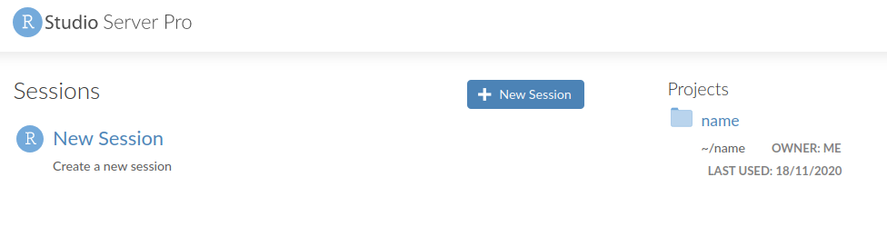
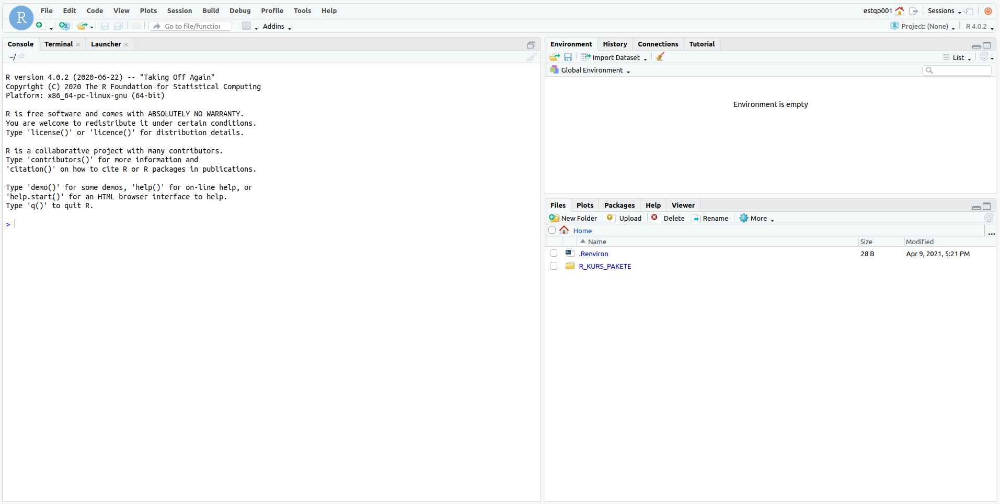

# Introduction to R and RStudio Server Pro

```{r include = F}
library(knitr) 
```


```{block, type='rmdoutcomes'}
- Login into the RStudio Server Pro
- Upload and download files from the server
- Use R as a calculator
- Create first objects in R
```

The goal this week is to introduce you to R and RStudio which you'll be using throughout the course both to learn statistical concepts and to analyze real data. To clarify which is which: R is the name of the programming language itself and RStudio is a convenient interface.

Today we begin with the fundamental building blocks of R and RStudio: the interface, creating and saving files, and basic commands.


## Opening RStudio Server Pro
We will work in the RStudio Server Pro, an online R System. Thus, you don't need to install R or RStudio on your computer. You will receive a login and a password for the server. **Do not share your credentials.** In case of difficulties I might need to login into your RStudio Server account. To allow me to do so, you need to sign an agreement and to email it to Dr. Andreas Bolten (andreas.bolten@uni-koeln.de).

Bevor you can login into the server, you need to activate the VPN client. If you anre not familiar with the VPN client, please visit [this website](https://rrzk.uni-koeln.de/en/internet-access-web/network-access/vpn).

To login into the RStudio Server,  [click hier](https://cheops-rstudio-edu.rrz.uni-koeln.de:8787/auth-sign-in). Or copy the address into your browser:  https://cheops-rstudio-edu.rrz.uni-koeln.de:8787/auth-sign-in.htm. After logging in, you will see the home interface  (Figure \@ref(fig:rserver)).

```{r rserver, echo = F, fig.cap = 'RStudio Server Pro Home', fig.width = 6, out.width = "100%"}

```

To start a new session, click on the button `New Session` next to the R symbol and choose the following settings (you can rename the session if you wish):

```{r neue-sesssion, echo = F, fig.cap = 'Starting a new session', fig.width = 6, out.width = "100%"}

```


## The RStudio interface

In RStudio Server you should see a window that looks like in Figure \@ref(fig:interface).


```{r interface, echo = F, fig.cap = 'RStudio interface', fig.width = 6, out.width = "100%"}

```

The panel on the left is where the action happens. It's called the *console*.  Every time you launch RStudio, it will have the same text at the top of the  console telling you the version of R that you're running.

The panel in the upper right contains your *workspace*. This shows the variables and objects you define during your R session, and a history of the commands that you enter. 

Any plots that you generate will show up in the panel in the lower right corner.  This is also where you can browse your files, and access help files, and upload and download files. 


## File management

We will start by making a data folder in RStudio Server that you can use to store all your data sets. Click on the Files tab in the lower right panel, and the New Folder tab. Enter the folder name `data` in the window that opens, and click OK. You should now have a new folder! 

Next, go to the course site, and **download** the file `meteo.csv` posted for this week's session. Put it in a location on your computer that you will remember! I **highly** suggest you **also** make a folder for the course and there a `data` folder on your computer to store the material for this course. 

To have access to files stored on the **hard drive** on your computer in RStudio Server, you need to **upload them from your computer to the server**. To upload the data set  click on the RStudio Server `data` folder **once**, and click the upload button, like so: 

```{r files-upload, echo = F, fig.cap = 'Upload files', fig.width = 6, out.width = "100%"}

```

In the window that opens, browse to where you stored your data set on your computer, click on the data file, then click OK. Open the `data` folder again in RStudio Server, to make sure the data is in there. You can upload any sort of file like this. 

We are not doing anything with this `meteo.csv` file, except learning how to upload it. 

To download a file first mark it (you can mark several files) by clicking on the little square left to it. Then, click the button `More` > `Export` > `Download` (Figures \@ref(fig:files-export) and \@ref(fig:files-download)). Save the file(s) on your computer.

```{r files-export, echo = F, fig.cap = 'Select files to download', fig.width = 6, out.width = "100%"}

```

```{r files-download, echo = F, fig.cap = 'Save files', fig.width = 6, out.width = "100%"}

```

## Logging out of the Server
There are a lot of stats classes and students using the Server. To keep it as fast as possible, it is best if you sign out when you are done. To do so follow all the same steps for closing an R Markdown document as above: 

- Save all your work. 
- Click on the orange button in the far right corner of the screen to quit R 
- Choose **don't save** for the **Workspace image**
- When the browser refreshes, you can click on the button `Sign Out` next to your login in the top right. 
- You are signed out! 

## Reading assignment
Chapters 1.1. and 1.2 in @ModernDive
