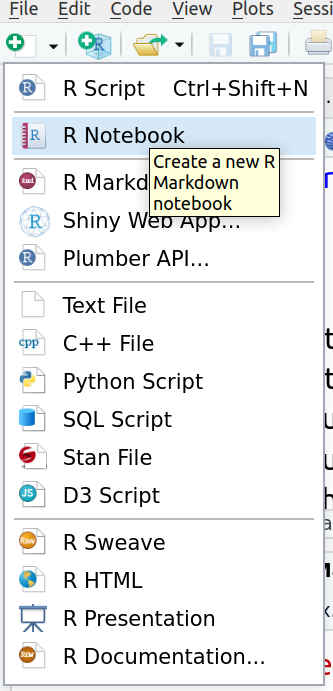
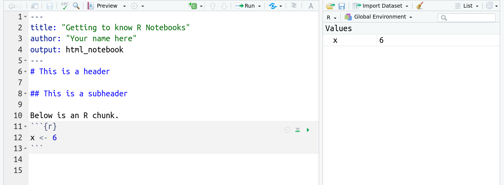

# Using R Markdown for reproducible research


```{block, type='rmdoutcomes'}
- Opening and saving an R Notebook
- Basic layout in R Markdown
```


## Reproducibility in research
to come

## Create a new R Notebook

When you want to write a paper, you have to open a Word document to type your ideas into, and save your work in. In R we use a document type called an R Markdown document. R Markdown documents are useful for both running code, and annotating the code with comments. The document can be saved, so you can refer back to your code later, and can be used to create other document types (html, word, pdf, or slides) for presenting the results of your analyses. R Markdown provides a way to generate clear and reproducible statistical analyses. 

There are different types of R Markdown documents. We will usually use the R Notebook.

To open a new R Notebook, click on the little green plus on the upper left hand and select R Notebook as in the image below. You can leave it untitled. 

```{r r-notebook, echo = F, fig.cap = 'How to create a new R Notebook', fig.width = 6, out.width = "40%"}

```

When you open a new R Notebook, there is some example code in it that you can get rid of. We will take care of this next. 

## Make changes to a file

Let's make some changes to the R Markdown file you just opened. Using the image below as a guide

- First, change the title at the top to "Getting to know R Notebooks". Be sure to keep the quotation marks. 
- Second, add an author line, following the example below. You need quotation marks!
- Third, delete everything in the document from line 6 downwards.
- Fourth, add headers and text, **exactly** following the example below. 
- Finally, insert what is called a "code chunk." To do this you click on the **insert** button near the top centre of the screen, then choose R. The greyed out box that shows up is where you type code. 

Your final result should look like this:

```{r rmarkdown-file, echo = F, fig.cap = 'An R Notebook', fig.width = 6, out.width = "100%"}
knitr::include_graphics('figures/new_chunk.png')
```

## Saving a file
I suggest to create a new folder `Notebooks` to save all your R Notebooks.

You will complete your lab work in an R Notebook file like this each week, so it is important to learn how to save these files. 

-  Click File > Save As...
-  Browse to the `Notebooks` course folder you just created
-  Name the file: `Session2_lastname_firstname` (fill in your firstname and lastname)
-  Click save

This is now saved in the `Notebooks` folder **on the server**. 

## Preview

Notebooks have the great advantage to offer the preview of your work. Just click the `Preview` button. The preview is refreshed every time you save your notebook.

## Other output options
You can also produce different outputs from your R Notebook because it is a normal R Markdown file and supports different output formats. However, if you produce an .html output, the `Preview` button will disappear! To bring it back, you need to edit the header of your R Notebook file to `output: html_notebook`.

```{block, type='rmdinfo'}
Note that there is now an R Notebook file (`.Rmd`) and an html file (`nb.html`) in the `Notebooks` folder.
```

Inspect the preview of your notebook to see how what you typed was formatted. There are lots of tricks for controlling the formatting of the knitted html file. For instance:

*  putting `##` and a space in front of text makes it into a large header. For example, see how `## This is a header` in your R Markdown `.Rmd` file translates in the resulting `.html` output.
*  putting `###` and a space in front of text makes it a smaller header!


## Entering and running commands

The code chunks are where you put R code in an R Markdown file. So far, your preview doesn't show anything, because we did not put any content in the code chunks yet! 

Using your first code chunk, type the following command to create a new variable called `x` with the value of 6. 

```{r}
x <- 6
```

The arrow `<-` is called an **ASSIGNMENT OPERATOR**, and tells R to save an object called `x` that has the value of 6. This is similar to saving a value in a graphing calculator. 

```{block, type='rmdinfo'}
Note that whatever you want to save must always be to the left of the assignment operator!!
```

To actually **RUN** this command in your console, you have a few options:

- click on the green triangle in the code chunk
- highlight the code and hit `Control-Enter` on a PC or `Command-Return` on a Mac

Think of "running" code in your console as telling R "do this".

```{block, type='rmdinfo'}
Note that you now have a new object in your workspace, called x!
```


```{r workspace, echo = F, fig.cap = 'Global environment contains the variable x now', fig.width = 6, out.width = "100%"}

```


## A brief recap of data types

So far you have made a numeric variable `x`. There many other types of data objects you can make in R.

First, copy, paste and run the following command in a new code chunk to make a **character** called `favorite_movie`. Think of characters as text as opposed to numerical values. Note that I told R that this was a **character** by putting quotation marks around `Star_Wars`. 

```{r}
favorite_movie <- "Star_Wars"
```

Next, copy, paste and run the following command into a new code chunk. 

```{r}
v <- c(2, 4, 6)
```

This makes what is called a **vector**, which we have named `v`. It is a data object that has multiple elements of the same type. This vector contains three numbers, 2, 4, and 6. The `c()` function says to r to `concatenate` the values 2, 4, 6, into a single **vector**. Note in the Environment pane that your vector `v` contains numbers (listed as `num`). 

You can do math on a vector that contains numbers! For instance, copy, paste and run the following command into a new code chunk. This tells R to multiply each element of the vector `v` by 3. 

```{r eval = F}
v * 3
```


## Practice on your own!

To complete this problem set you will next run through some Exercises, and submit your R Notebook file with answers to all the Exercises. Please make a **header** for each of these Exercises. If you need to answer an Exercise with text, type the text **below** the header, on the next line, in the white part, and if you need to answer an Exercise with some code, insert a code chunk **below** the header, and put the code in the greyed out box. 


```{block, type='rmdalert'}
Remember to save your work as you go along! Click the save button in the upper left hand corner of the R Markdown window.
```


<ol class ="exercises">
1.  Answer the following with code in a code chunk (no text necessary). Remember that the code is just **instructions** for R. You need to run the code chunk to make R execute those instructions!
    -   Create a variable called `y` with the value of 7 
    -   Multiply `x` by `y`, and store the answer in a variable named `z` like so: `z <- x * y`
    -   You should now see `favorite_movie`, `x`, `v`, `y`, and `z` all in your Environment pane 
    
   
1.  - Run the following mathematical operation in a code chunk: `6 + 3` 
    - Where does the answer appear? (please answer with **text**)
    
1.  - Now add a code chunk, and save the results of `6 + 3` as a variable called a. 
    - Does the answer appear? (please answer with **text**)
    - Where does the object `a` show up? (please answer with **text**)
    - Next type `a` into the code chunk and re-run the code chunk. What happens? (please answer with **text**)


1.   - Run following command in a new code chunk. `a^2`. 
     - What does the `^` operator do? (please answer with **text**)

1.   - Type the following command into a new code chunk. `sum(a, x, y)` 
     - `sum` is a function. Based on the output, what do you think the `sum` function does? (please answer with **text**)

1.    - Click the little broom icon in the upper right hand corner of the **Environment** pane. Click yes on the window that opens. 
      - What happened? (please answer with **text**, and don't freak out)

1.   - Go to the **Run** button at the top right of the R Markdown pane, and choose **Run All** (the last option)
     - What happened? (please answer with **text**)
     

1.  Recall the vector `v` we created earlier. Copy, paste and run the following in a code chunk. What does this code accomplish?
<br>
`v + 2`
<br>
Please answer with **text**.

1.  Copy, paste, and run the following code to make a vector called `music`, that contains music genres. Recall a vector is a data object that has multiple elements of the same type. Here the data type is a **character**. Look in the environment pane. How does R tell us that this vector contains **characters**, not numbers?
<br>
`music <- c("bluegrass", "funk", "folk")`
<br>
Please answer with **text**.

1. Now let's practice some basic formatting. Using <a href="https://rmarkdown.rstudio.com/authoring_basics.html" target="_blank">this formatting tips page</a> figure out how to put the following into your lab report. These all can get typed into the white section, where text goes. **Hint:** To put  **each of these on its own line!** hit a hard return between each line of text.
<br>
*Italicize like this*
<br>
**Bold like this**
<br>
A superscript: R^2^
</ol>


## Turning in your work
- Save your R Notebook as an *.Rmd file. 
- Upload your R Notebook to ILIAS. You don't need to upload the .nb.html file. You will find an upload option in today's session.
- You should receive a solution file after your upload. **Be sure to upload before the deadline!**
