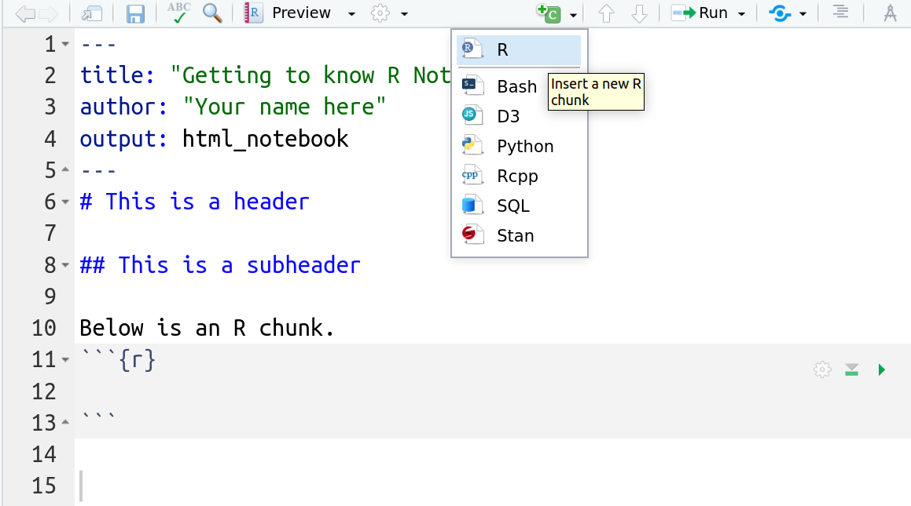

# Using R Markdown for reproducible research


```{block, type='rmdoutcomes'}
- Opening and saving an R Notebook
- Basic layout in R Markdown
```


## Reproducibility in research
Usually, analysing data and generating the report are two separate tasks. First, you analyse your data (hopefully in R `r emo::ji('smile')`), and then you describe your methods, results and conclusions in a text document. However, this procedure is error-prone and not reproducible. You have to copy-paste results from R into tables or include figures in your word processor. The connection between the analysis code, the results and the report is lost. 

Donald Knuth, the creator of TEX, suggested the idea of *literate programming*, where analysis code and the report are combined in one document [@Knuth1984]. This kind of document is human-centred and allows to better understand the analysis. It helps to generate completely reproducible data analyses.

## Combining code and report in one document
We will use **R Markdown** to combine analysis code and report in one reproducible document. In general, R Markdown can produce different output documents (html, word, pdf, or slides). However, in this course we will concentrate on html output and use so-called R Notebooks (mostly).

### Create a new R Notebook
To create a new R Notebook, click on the little green plus or click on `File` on the upper left hand and select R Notebook as in the image below. Save your notebook in the subfolder **notebooks**. 

```{r r-notebook, echo = F, fig.cap = 'How to create a new R Notebook', fig.width = 6, out.width = "40%"}
knitr::include_graphics('figures/r-notebook.png')
```

In contrast to a new R script, a new notebook has some template text and example R code in grey boxes called **chunks**. Have a look at this template text. It provides basic example of layout and R code chunks. 

### Customize the header
Every R Markdown document starts with a header. It is enclosed between two lines of `---` signs. Inside the header, you find some (blue) keywords like `title:` and `output:`. Let's customize the header for our needs:

- Change the title at the top to "Getting to know R Notebooks". Be sure to keep the quotation marks. 

- Add an author line and put your name there in quotation marks.

Additionally, you might want to add the date. The syntax is `date: "some date here"`.

### Structure your notebook
Structure with headers and subheaders helps to orginze content and ideas. To add a header, put `# ` followed by the header title. Be sure to include a space between # and the text! A subheader is produced with `## ` and a subsubheader with `### `. Be sure to include a space before the header text!

Delete the template text and structure your notebook. Your final result should look something like this:

```{r rmarkdown-file, echo = F, fig.cap = 'An R Notebook', fig.width = 6, out.width = "100%"}

```


### Preview
Notebooks have the great advantage to offer the preview of your work. Just click the `Preview` button. The preview is refreshed every time you save your notebook.

Inspect the preview of your notebook to see how your formatting with headers and subheaders affects the output. There more layout elements, and you will experiment with them in the exercises.

### Other output options
You can also produce different outputs from your R Notebook because it is a normal R Markdown file and supports different output formats. However, if you produce an .html output, the `Preview` button will disappear! To bring it back, you need to edit the header of your R Notebook file to `output: html_notebook`.

```{block, type='rmdinfo'}
Note that there is now an R Notebook file (`.Rmd`) and an html file (`nb.html`) in the `Notebooks` folder.
```


## Entering and running commands
In contrast to text, headings etc. R code is typed in special boxes called **chunks**. To create an empty chunk to type code, click the little green C on top or type `Str + Alt + i`. On an international keyboard, `Str` equals `Control` and on a Mac the `Command` key.

Using your first code chunk, type the following command to create a new variable called `x` with the value of 42. 

```{r}
x <- 42
```

Remember that the arrow `<-` is the **assignment operator**. It generates (or overwrites, if it already exists) the object `x` and assigns it the value of 42. 

```{block, type='rmdinfo'}
Note the direction of the arrow! It points from the value to the object name.
```

To **Run** this command in your console, you can either:

- click on the green triangle in the code chunk on the right or
- highlight the code in the chunk and hit `Str + Enter` (as in an R script).


```{block, type='rmdinfo'}
Note that you now have a new object in your workspace, called x!
```


```{r workspace, echo = F, fig.cap = 'Global environment contains the variable x now', fig.width = 6, out.width = "100%"}
knitr::include_graphics('figures/workspace.png')
```


## A brief recap of data types
You have created a numeric variable `x`. However, you are not restricted to numbers. R can also handle other types of objects, like characters, for example. To tell R that you want to generate a variable containing characters in contrast to numbers, you need to enclose the assigned content in quotes.

Create the following chunk in your notebook and let it run.

```{r}
day_of_week <- "Sunday"
```

To generate a more complicated object, namely a numeric **vector**, we use the command `c()` to *concatenate*  several numbers.

```{r}
v <- c(4.5, 6.234, 10)
```

Note in the Environment pane that your vector `v` contains numbers (listed as `num`). The information [1:3] shows you that your vector has three elements, indexed from 1 to 3. Indices indicate the place of an element in the vector. To access and change a particular element, we use its index like

```{r}
v[2] <- 4.5
```

Now the second element of your vector equals 4.5. Remember that R will not warn you when changing your objects!

You can calculate with objects as you can with numbers. Let's divide evely single element of v by 2.

```{r eval = F}
v / 2
```


## Practice on your own!
When you work on your exercises, please structure your R Notebook with e.g. headers and subheaders for each exercise. Some of the exercises require code and explanation!


```{block, type='rmdalert'}
Remember to save your work as you go along! Click the save button in the upper left hand corner of the R Markdown window.
```


<ol class ="exercises">
1.  Answer the following with code in a code chunk (no text necessary). Remember that the code is just **instructions** for R. You need to run the code chunk to make R execute those instructions!
    -   Create a variable called `y` with the value of 13.
    -   Multiply `x` by `y`, and store the answer in a variable named `z` like so: `z <- x * y`
    -   You should now see `day_of_week`, `x`, `v`, `y`, and `z` all in your Environment pane.
    
   
1.  - Run the following mathematical operation in a code chunk: `6 + 3`.
    - Where does the answer appear?
    
1.  - Now add a code chunk, and save the results of `6 + 3` as a variable called a. 
    - Does the answer appear?
    - Where does the object `a` show up?
    - Next type `a` into the code chunk and re-run the code chunk. What happens?

1.   - Run following command in a new code chunk. `a^2`. 
     - What does the `^` operator do?

1.   - Type the following command into a new code chunk. `sum(a, x, y)` 
     - `sum` is a function. Based on the output, what do you think the `sum` function does?

1.    - Click the little broom icon in the upper right hand corner of the **Environment** pane. Click yes on the window that opens. 
      - What happened?

1.   - Go to the **Run** button at the top right of the R Markdown pane, and choose **Run All** (the last option)
     - What happened?
     

1.  Recall the vector `v` we created earlier. Copy, paste and run the following in a code chunk. What does this code accomplish?
<br>
`v + 2`
<br>

1.  Copy, paste, and run the following code to make a vector called `music`, that contains music genres. Recall a vector is a data object that has multiple elements of the same type. Here the data type is a **character**. Look in the environment pane. How does R tell us that this vector contains **characters**, not numbers?
<br>
`music <- c("bluegrass", "funk", "folk")`
<br>

1. Now let's practice some basic formatting. Using <a href="https://rmarkdown.rstudio.com/authoring_basics.html" target="_blank">this formatting tips page</a> figure out how to put the following into your lab report. These all can get typed into the white section, where text goes. **Hint:** To put  **each of these on its own line!** hit a hard return between each line of text.
<br>
*Italicize like this*
<br>
**Bold like this**
<br>
A superscript: R^2^
</ol>


## Turning in your work
- Save your R Notebook as an *.Rmd file. 
- Upload your R Notebook to ILIAS. You don't need to upload the .nb.html file. You will find an upload option in today's session.
- You should receive a solution file after your upload. **Be sure to upload before the deadline!**
