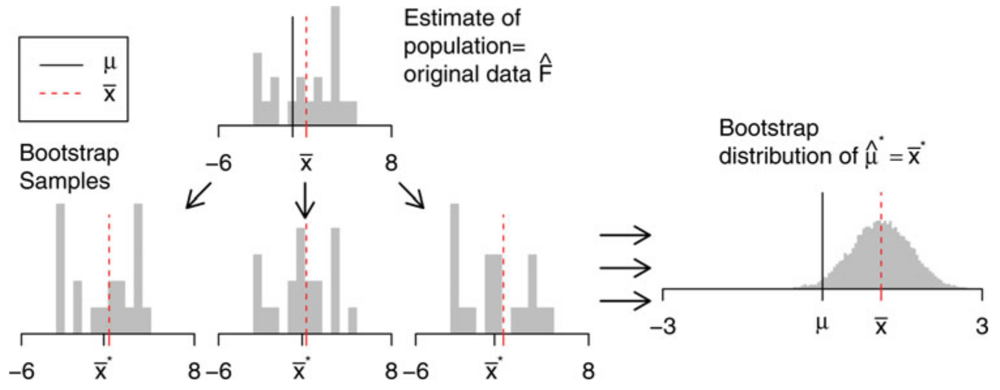

# Bootstrap and confidence intervals {#bootstrap}

```{block, type='rmdoutcomes'}
- Explain the idea behind the bootstrap
- Calculate bootstrap confidence intervals for the mean
```

In chapter \@ref(sampling) we studied the variability of **repeated random sampling from a population**. We did computer experiments and sampled from a simulated population repeatedly without replacement (i.e. the data could appear in the sample only once) and calculated a statistics, the proportion of rural and urban residents. Such a statistics is a **random variable**, and it is characterized by the **sampling distribution**. It shows which values you can expect by randomly sampling from a population.

We learned that the shape of the sampling distribution and the size of its standard error depended on the sample size. In this chapter, we will learn how to quantify the standard error or to calculate plausible values (confidence intervals) for real-life applications, when you have one sample only.


## The formulas
You will never have the opportunity to sample/survey repeatedly to estimate the information (i.e. a statistics or parameter) about the population of interest. In real-life applications, you will have one (hopefully cleverly obtained) random sample. So, how can we have access to the shape of the sampling distribution? For several standard statistics, there are formulas that describe the standard error. You have probably learned that the standard error for the estimated mean equalled $\sigma/\sqrt(n)$, $\sigma$ being the variance of the population and $n$ the sample size. If you don't know the variance of the population, then you have to estimate it from the sample itself. But where does this formula come from? The crucial **Central Limit Theorem** tells us that the random variable **mean** that we can estimate from our random sample is normally distributed with a mean equalled to the true mean of the population and the standard deviation of, you guessed it, $\sigma/\sqrt(n)$. Based on the normal distribution, we can calculate plausible values, a so-called **confidence interval**. Informally, we could define the confidence interval as follows:

> Is there a plausible range of values that we could obtain if we randomly sample from a population? Plausible means that if we repeated the sampling very often, this range would contain the true mean in let's say 95% of the time. Such a plausible range is called a **95% confidence interval**.

Because we know the theoretical distribution of the mean we can calculate the 95% confidence interval as $\hat\mu \pm 1.96 \cdot SE$, with $\hat\mu$ being the estimated mean, $SE$ the standard error $\sigma/\sqrt(n)$ and the magic factor of 1.96 comes from the fact that in a normal distribution, 95% of all values fall into the interval $\mu \pm 1.96 \cdot sd$, $sd$ being the standard deviation.


## Bootstrap -- use your computer
Formulas date from the early time of statistics, where computational power was limited or unavailable and approximations were the only tools one could use to estimate the variability. The Central Limit Theorem is very useful, but theoretical distributions do not always exist. In such cases, we can use our computer to calculate confidence intervals using **re-sampling**, i.e. repeated sampling from our random sample. This method is called bootstrap (or bootstrapping) and sounds like self-deception à la Baron Munchausen at first glance (Figure \@ref(fig:meunch)). However, it has a solid mathematical foundation [@Efron1979].

```{r meunch, echo = F, fig.cap = 'Münchhausen removes himself from the swamp using his own braids (Theodor Hosemann (1807-1875), Public domain, via Wikimedia Commons) [Link to figure](https://upload.wikimedia.org/wikipedia/commons/a/ad/M%C3%BCnchhausen-Sumpf-Hosemann.png)', fig.width = 6, out.width = "80%"}
knitr::include_graphics('figures/Münchhausen-Sumpf-Hosemann.png')
```

Figure \@ref(fig:sampling-world) shows the setup that we practised in chapter \@ref(sampling). We wanted to estimate a parameter (proportion of rural and urban residents) called $\mu$ in the figure, and we sampled randomly several times from the population. From all those random samples, we calculated our statistics and obtained the sampling distribution.

```{r sampling-world, echo = F, fig.cap = 'Calculation of a sampling distribution by repeated random sampling from a population. Figure by @Hesterberg2015, their Figure 4. The publication is open-access and can be used for non-commercial purposes. [Link to licence](https://www.tandfonline.com/action/showCopyRight?scroll=top&doi=10.1080%2F00031305.2015.1089789)', fig.width = 6, out.width = "80%"}
knitr::include_graphics('figures/sampling_world.png')
```

Figure \@ref(fig:sampling-bootstrap) looks nearly the same, except one important difference. We don't have access to several random samples from the population, but have one random sample only. And now we remember that we invested time and energy in thinking about the best way to obtain this sample, and we believe that it is representative of our population. Thus, we can think about this sample as our *mini* population. We replace the population by its miniature, i.e. our sample, and sample from this sample as if it were the true population. However, because the sample is limited in size, we have to sample **with replacement**. The random samples we obtain by sampling with replacement from the original random sample are called bootstrap samples. For each of those bootstrap samples, we calculate the statistics and obtain its bootstrap sampling distribution. The confidence intervals are most often calculated by the so-called percentile method: we take the 2.5% quantile and the 97.5% quantile from the sampling distribution. The range of values in-between equals the 95% bootstrap confidence interval.


```{r sampling-bootstrap, echo = F, fig.cap = 'Calculation of a sampling distribution by repeated random sampling with replacement from a sample. Figure by @Hesterberg2015, their Figure 5. The publication is open-access and can be used for non-commercial purposes. [Link to licence](https://www.tandfonline.com/action/showCopyRight?scroll=top&doi=10.1080%2F00031305.2015.1089789)', fig.width = 6, out.width = "80%"}

```


## Confidence intervals for the mean travel time
Let's come back to our simulated getsmarter university population and estimate the mean travel time with its bootstrap confidence interval.

```{r, message = F, error = F}
library(tidyverse)
library(infer)
```

```{r}
set.seed(123)

student_id <- 1:12000
  
travel_time <- c(runif(n = 12000 * 0.8, min = 5, max = 40),
             runif(n = 12000 * 0.2, min = 60, max = 120))

gender <- sample(c('m', 'f'), size = 12000, replace = TRUE)

residence <- sapply(travel_time, function(x) {
  if(x < 30) 'urban'
  else 'rural'
})

transport <- sapply(travel_time, function(x) {
  if(x <= 10) 'foot'
  else if(x > 10 & x <= 15) sample(c('foot', 'bike'), size = 1)
  else if(x > 15 & x <= 45) sample(c('bus', 'bike', 'car'), size = 1)
  else sample(c('bus', 'car'), size = 1)
})

time_lib <- 5 * 60 - 0.7 * travel_time + rnorm(length(travel_time), 0, 20)

getsmarter_pop <- tibble(student_id, gender, residence, transport, travel_time, time_lib)

getsmarter_pop
```

We survey 200 students using the function `rep_sample_n`, with one replicate and without replacement. This function adds a new variable called `replicate` to the dataset. Later we will use the same function for bootstrapping, which will generate another `replicate` variable. To prevent conflicts from having duplicate variable names, we need to remvoe the existing `replicate` variable now. We do this using `select(!...)`, which drops a variable from the dataset. 
```{r}
set.seed(345)

survey_size <- 200

survey <- rep_sample_n(getsmarter_pop, size = survey_size, replace = FALSE, reps = 1) %>%
  ungroup() %>%
  select(!replicate)
```

The true mean travel time to the university and the mean from the survey equal
```{r}
mean_pop <- getsmarter_pop %>% 
  summarise(mean = mean(travel_time))

mean_pop

mean_survey <- survey %>% 
  summarise(mean = mean(travel_time))

mean_survey
```

To calculate the bootstrap distribution, we sample from the data set `survey` with replacement. The size of the bootstrap samples always equal the size of the original sample. We use the same function `rep_sample_n` as in chapter \@ref(sampling), but change `replace = TRUE`.

```{r}
set.seed(345)

reps_num <- 10000

survey_reps_bootstrap <- rep_sample_n(survey, size = survey_size, replace = TRUE, reps = reps_num)

survey_reps_bootstrap
```

Because we sample with replacement, students can now appear several times in one and the same bootstrap sample. Let's check this for the first 50 bootstrap samples. Student 4787 was sampled 8 times in the replicate 43, for example.

```{r}
survey_reps_bootstrap %>% 
  filter(replicate %in% (1:50)) %>% 
  group_by(replicate, student_id) %>% 
  tally() %>% 
  filter(n != 1) %>% 
  arrange(desc(n))
```

Now we can calculate the mean travel times from the bootstrap samples.
```{r}
res_means_bootstrap <- survey_reps_bootstrap %>%
  group_by(replicate) %>% 
  summarise(mean_tt = mean(travel_time))

res_means_bootstrap
```

The standard error and the 95% confidence interval based on the bootstrap are calculated as follows:
```{r}
stat_bootstrap <- res_means_bootstrap %>% 
  summarize(mean_bootstrap = mean(mean_tt), se = sd(mean_tt), ci_2.5 = quantile(mean_tt, probs = 0.025), ci_97.5 = quantile(mean_tt, probs = 0.975))

stat_bootstrap
```

## Bootstrap with the library `infer`
The library `infer` offers a convenient framework for calculating the bootstrap confidence intervals and to do hypothesis tests. We will talk about the latter in a later session. `infer` is a dedicated package for *tidy* inference and is organized around 5 verbs:

1. `specify()` variables or relationships between them
1. `hypothesize()` define the null hypothesis (for hypothesis tests only)
1. `generate()` generate data either for the confidence intervals or under the null hypothesis
1. `calculate()` the sampling distribution
1. `visualize()` visualize the sampling distribution

How does our example of calculating the bootstrap confidence intervals for the mean travel time look like in the `infer` workflow?

We first calculate the bootstrap distribution.
```{r}
set.seed(345)

bootstrap_distribution <- survey %>%
  specify(response = travel_time) %>% 
  generate(reps = 10000, type = 'bootstrap') %>% 
  calculate(stat = 'mean')
```

Then, we calculate the confidence intervals based on the percentile method.
```{r}
percentile_ci <- bootstrap_distribution %>% 
  get_confidence_interval(level = 0.95, type = "percentile")
percentile_ci
```

And then visualize all results. Because the function `visualize` is based on `ggplot2`, we can add custom axis labels.
```{r}
visualize(bootstrap_distribution) + 
  shade_confidence_interval(endpoints = percentile_ci, color = "orange", fill = "khaki") +
  geom_vline(xintercept = mean_pop$mean, linetype = 'dashed') +
  labs(x = 'Mean trave time (min)', y = 'Frequency')
```

## Interpreting the confidence intervals
The upper and lower limit of the confidence interval depend on the sample, i.e. they are themselves random variables. Definitely, random variables are everywhere `r emo::ji('smile')`. It means that the confidence interval could fail to include the true population parameter. We are now ready for a more formal definition of a confidence interval:

> If we repeat the sampling very often and recalculate the 95% confidence intervals, we expect them to contain the true population parameters in about 95% of the time.

It means that some confidence intervals won't contain the true population parameter.

The confidence interval is our best guess of plausible values for the population parameter. In case of a theoretical distribution of the statistics, the bootstrap and the theoretical confidence intervals coincide. Often, the interpretation is short-handed as: We are 95% confident that the confidence interval captures the true parameter. This is incorrect. It is better to state that in 95% of the time, the confidence interval captures the true population parameter. And now you know what is meant by "95% of the time" `r emo::ji('smile')`.

## Practice on your own!
<ol class ="exercises">
1. Repeat the analysis we did for the mean travel time now for the proportion of urban residents. Use the workflow in `infer`. Hint: `specify(response = residence, success = 'urban')`.

1. How does the width of the confidence interval depend on the sample size? Repeat the analysis for the mean travel time for a survey of 30 students.

</ol>

## Reading assignment
Chapter 8 in @ModernDive


## Turning in your work
- Save your R Notebook as an *.Rmd file. 
- Upload your R Notebook to ILIAS. You don't need to upload the .nb.html file. You will find an upload option in today's session.
- You should receive a solution file after your upload. **Be sure to upload before the deadline!**
