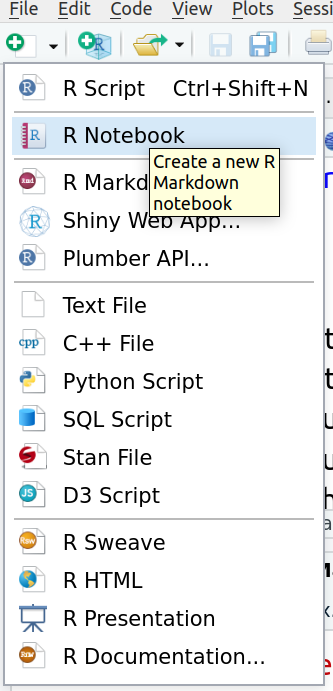
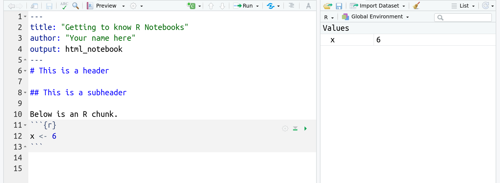

```{r include=FALSE, cache=FALSE}
# Load libraries
library(fontawesome)
library(kableExtra)
library(tidyverse)
library(DT)

knitr::knit_hooks$set(document = function(x) {
  sub('\\usepackage{graphicx, color}',
      '\\usepackage{graphicx,xcolor}', x, fixed = TRUE)
}) 


# These are different helper functions for the book

colorize <- function(x, color) {
  if (knitr::is_latex_output()) {
    sprintf("\\textcolor{%s}{%s}", color, x)
  } else if (knitr::is_html_output()) {
    sprintf("<span style='color: %s;'>%s</span>", color, 
            x)
  } else x
}

file.name <- function(x) {
  if (knitr::is_latex_output()) {
    sprintf("\\texttt{%s}", x)
  } else if (knitr::is_html_output()) {
    sprintf("<span style='font-family: sans-serif; font-size: 12pt'>%s</span>",
            x)
  } else x
}
```

# Preface {-}

> The most exciting phrase to hear in science, the one that heralds new discoveries, is not 'Eureka!' but 'That's funny...' 
`r tufte::quote_footer('--- Isaac Asimov')`


In this course, we will use the following tools:


**ILIAS**: the moodle platform at the UoC. You should all be registered there already.


**Datacamp**: a platform with additional training material for working with R.


## Intended learning outcomes (ILOs) {-}
At the end of this course you should be able to

```{block, type='rmdoutcomes'}
- Import/read data into R.
- Prepare data for analysis.
- Visualize data.
- Explain and apply statistical methods learnt in this course.
- Combine code and report in a reproducible way.
- Apply selected methods learnt in this course to a new data set and write a reproducible report.
```


## Literature {-}
We will be using the book [ModernDive: Statistical Inference via Data Science](https://moderndive.com/) [@ModernDive] mainly. Additionally, I will recommend from time to time [R for Data Science](https://r4ds.had.co.nz/) [@r4ds] and [OpenIntro Statistics](https://www.openintro.org/book/os/) [@Diez2019]. For your report, you will do an additional literature search depending on your topic.


## Why these lecture notes {-}

This document is a working and live document that will be updated during the course. It is not comprehensive, but should help you to navigate through the introduction to R and statistics smoothly.

I will use different colour boxes

```{block, type='rmdinfo'}
Infos and tips
```


```{block, type='rmdoutcomes'}
Learning outcomes
```


```{block, type='rmdalert'}
This is important
```


```{block, type='rmddef'}
This is a definition
```


```{block, type='exercises'}
1. This is an exercise inside a chapter.
```


<!-- <br> -->

<!-- ```{block, type='rmdsummary'} -->
<!-- Zusammenfassung -->
<!-- ``` -->


## Acknowledgements {-}

This document draws on the free material provided by 

- ModernDive: @ModernDive and their free Problem Sets authored by Jenny Smetzer, William Hopper, Albert Y. Kim, and Chester Ismay (https://moderndive.github.io/moderndive_labs/index.html)

- R for Data Science (r4ds): @r4ds

- Data Science in a Box (https://datasciencebox.org/) and the free book by @Diez2019

One cannot thank those people enough for their contribution to the `r fa("r-project", fill = "steelblue")` community `r fa("heart", fill = "red")`!


{width=70%}

Credit: https://xkcd.com/2400/

<br>

## Reproducibility {-}
This book was written in [RStudio](https://www.rstudio.com/products/rstudio/) using [Bookdown](https://bookdown.org/) and compiled in `r R.version.string`. You will need the following packages to reproduce the examples and to work through the exercises:

```{r, echo = FALSE, cache = FALSE}
# code from ggplot2 book
# https://github.com/hadley/ggplot2-book/blob/master/introduction.Rmd
    deps <- desc::desc_get_deps()
    pkgs <- sort(deps$package[deps$type == "Imports"])
    pkgs2 <- strwrap(paste(encodeString(pkgs, quote = '"'), collapse = ", "), exdent = 2)
    install <- paste0(
      "install.packages(c(\n  ", 
      paste(pkgs2, "\n", collapse = ""), 
      "))"
    )
```


```{r, echo = FALSE, results="asis"}
# code from ggplot2 book
# https://github.com/hadley/ggplot2-book/blob/master/introduction.Rmd
pkgs <- sessioninfo::package_info(pkgs, dependencies = FALSE)
df <- tibble(
  package = pkgs$package,
  version = pkgs$ondiskversion,
  source = gsub("@", "\\\\@", pkgs$source)
)
knitr::kable(df, format = "markdown")
```

The complete information on the last session to build the book:

```{r, echo = FALSE,}
sessionInfo()
```


{width=30%}

This work is licensed under a [Creative Commons Attribution-NonCommercial-ShareAlike 4.0 International License.](https://creativecommons.org/licenses/by-nc-sa/4.0/)

<!--chapter:end:index.Rmd-->

```{r include=FALSE, cache=FALSE}
# Load libraries
library(fontawesome)
library(kableExtra)
library(tidyverse)
library(DT)

knitr::knit_hooks$set(document = function(x) {
  sub('\\usepackage{graphicx, color}',
      '\\usepackage{graphicx,xcolor}', x, fixed = TRUE)
}) 


# These are different helper functions for the book

colorize <- function(x, color) {
  if (knitr::is_latex_output()) {
    sprintf("\\textcolor{%s}{%s}", color, x)
  } else if (knitr::is_html_output()) {
    sprintf("<span style='color: %s;'>%s</span>", color, 
            x)
  } else x
}

file.name <- function(x) {
  if (knitr::is_latex_output()) {
    sprintf("\\texttt{%s}", x)
  } else if (knitr::is_html_output()) {
    sprintf("<span style='font-family: sans-serif; font-size: 12pt'>%s</span>",
            x)
  } else x
}
```
# (PART) Part I: Explore data {-}
# Introduction to R and RStudio

```{block, type='rmdoutcomes'}
- Create and save files in RStudio
- Use R as a calculator
- Create first objects in R
- Call first functions in R
- Do you very first plot
```

This chapter introduces you to R and RStudio which you'll be using throughout the course both to learn statistical concepts and to analyse real data. Often, R and RStudio are confused. However, they are not the same: R is the name of the programming language itself and RStudio is a so-called *integrated development interface* (IDE), a development environment that will make your life easier.

## What is `r fa("r-project", fill = "steelblue")`?
R is a programming language for data analysis and statistical modelling. It is free (*open-source software*) and belongs, together with Python, to the most popular programming languages for data analysis. R has been introduced by Ross Ihaka and Robert Gentleman in 1996 [@Ihaka1996]. It has many additional *packages*, which extend its functionality.

You can and should install R on your computer through the official [R webpage](https://www.r-project.org/). A short installation instruction with a list of packages for this course can be found on ILIAS. Additionally, you can refer to @ModernDive, Chapter 1. You will find packages on R's official webpage under CRAN (*The Comprehensive R Archive Network*). Not all packages are released through CRAN. However, in the beginning it is a good idea to use CRAN to find and install packages. 

Packages are sometimes organized in topics, which you can explore via the [CRAN Task Views](http://cran.r-project.org/web/views/). For environmental statistics, the following topics are relevant:

- Environmetrics: analysis of environmental data
- Multivariate: multivariate statistics
- Spatial: analysis of spatial data
- TimeSeries: time series analysis.


## What is RStudio?
RStudio Desktop is an IDE for R (and some other languages). You can download and install the *open-source* version for your computer [here](https://rstudio.com/products/rstudio/#rstudio-desktop). The RStudio interface is split in four main areas (Figure \@ref(fig:rstudio)).

On the top left, you will type your commands and your text. The focus of this course is on reproducible research, and we will start using R Markdown in the next session.

The panel on the bottom left is the *console* where R executes your commands. This is the proper R system. When you start RStudio, the standard R text will be displayed there to inform you about the R being open source, its version and some other useful things.

The panel in the upper right contains your *workspace*, i.e. the objects that you generated during your working session in R. Additionally, you will find the history of your commands there.

The panel in the bottom right will show your plots (in case you are working with simple scripts and not with RMarkdown files). The tab "Files" helps you to browse your files.

```{r rstudio, echo = F, fig.cap = 'RStudio interface', fig.width = 6, out.width = "100%"}
knitr::include_graphics('figures/RStudio_engl.png')
```


## Organize your work
To better organize your files, create a subfolders for **data**, **scripts** and **notebooks** in your main folder.


## Practice on your own!

We will start the exercises \@ref(rob1) and \@ref(rob2) in class. Finish the exercises on your own and produce your first plot in exercise \@ref(firstplot) `r emo::ji('smile')`. If you need to type comments or answer with text, don't forget to use the comment sign `#` at the beginning of each text line. Otherwise, R will misinterpret your text as commands and will try to execute them.

```{block, type='rmdalert'}
Remember to save your R script regularly! Click the save button in the upper left-hand corner of the window or hit Stg+s.
```


## Turning in your work
- Save your R script as *.R file.
- Upload your *.R file to ILIAS. You will find an upload option in today's session.
- You should receive a solution file after the upload.

```{block, type='rmdalert'}
Be sure to upload before the deadline!
```


## Reading assignment
Chapters 1.1 and 1.2 in @ModernDive

<!--chapter:end:01-intro.Rmd-->

```{r include=FALSE, cache=FALSE}
# Load libraries
library(fontawesome)
library(kableExtra)
library(tidyverse)
library(DT)

knitr::knit_hooks$set(document = function(x) {
  sub('\\usepackage{graphicx, color}',
      '\\usepackage{graphicx,xcolor}', x, fixed = TRUE)
}) 


# These are different helper functions for the book

colorize <- function(x, color) {
  if (knitr::is_latex_output()) {
    sprintf("\\textcolor{%s}{%s}", color, x)
  } else if (knitr::is_html_output()) {
    sprintf("<span style='color: %s;'>%s</span>", color, 
            x)
  } else x
}

file.name <- function(x) {
  if (knitr::is_latex_output()) {
    sprintf("\\texttt{%s}", x)
  } else if (knitr::is_html_output()) {
    sprintf("<span style='font-family: sans-serif; font-size: 12pt'>%s</span>",
            x)
  } else x
}
```
# Using R Markdown for reproducible research


```{block, type='rmdoutcomes'}
- Opening and saving an R Notebook
- Basic layout in R Markdown
```


## Reproducibility in research
Usually, analysing data and generating the report are two separate tasks. First, you analyse your data (hopefully in R `r emo::ji('smile')`), and then you describe your methods, results and conclusions in a text document. However, this procedure is error-prone and not reproducible. You have to copy-paste results from R into tables or include figures in your word processor. The connection between the analysis code, the results and the report is lost. 

Donald Knuth, the creator of TEX, suggested the idea of *literate programming*, where analysis code and the report are combined in one document [@Knuth1984]. This kind of document is human-centred and allows to better understand the analysis. It helps to generate completely reproducible data analyses.

## Combining code and report in one document
We will use **R Markdown** to combine analysis code and report in one reproducible document. In general, R Markdown can produce different output documents (html, word, pdf, or slides). However, in this course we will concentrate on html output and use so-called R Notebooks (mostly).

### Create a new R Notebook
To create a new R Notebook, click on the little green plus or click on `File` on the upper left hand and select R Notebook as in the image below. Save your notebook in the subfolder **notebooks**. 

```{r r-notebook, echo = F, fig.cap = 'How to create a new R Notebook', fig.width = 6, out.width = "40%"}

```

In contrast to a new R script, a new notebook has some template text and example R code in grey boxes called **chunks**. Have a look at this template text. It provides basic example of layout and R code chunks. 

### Customize the header
Every R Markdown document starts with a header. It is enclosed between two lines of `---` signs. Inside the header, you find some (blue) keywords like `title:` and `output:`. Let's customize the header for our needs:

- Change the title at the top to "Getting to know R Notebooks". Be sure to keep the quotation marks. 

- Add an author line and put your name there in quotation marks.

Additionally, you might want to add the date. The syntax is `date: "some date here"`.

### Structure your notebook
Structure with headers and subheaders helps to orginze content and ideas. To add a header, put `# ` followed by the header title. Be sure to include a space between # and the text! A subheader is produced with `## ` and a subsubheader with `### `. Be sure to include a space before the header text!

Delete the template text and structure your notebook. Your final result should look something like this:

```{r rmarkdown-file, echo = F, fig.cap = 'An R Notebook', fig.width = 6, out.width = "100%"}
knitr::include_graphics('figures/new_chunk.png')
```


### Preview
Notebooks have the great advantage to offer the preview of your work. Just click the `Preview` button. The preview is refreshed every time you save your notebook.

Inspect the preview of your notebook to see how your formatting with headers and subheaders affects the output. There more layout elements, and you will experiment with them in the exercises.

### Other output options
You can also produce different outputs from your R Notebook because it is a normal R Markdown file and supports different output formats. However, if you produce an .html output, the `Preview` button will disappear! To bring it back, you need to edit the header of your R Notebook file to `output: html_notebook`.

```{block, type='rmdinfo'}
Note that there is now an R Notebook file (`.Rmd`) and an html file (`nb.html`) in the `Notebooks` folder.
```


## Entering and running commands
In contrast to text, headings etc. R code is typed in special boxes called **chunks**. To create an empty chunk to type code, click the little green C on top or type `Str + Alt + i`. On an international keyboard, `Str` equals `Control` and on a Mac the `Command` key.

Using your first code chunk, type the following command to create a new variable called `x` with the value of 42. 

```{r}
x <- 42
```

Remember that the arrow `<-` is the **assignment operator**. It generates (or overwrites, if it already exists) the object `x` and assigns it the value of 42. 

```{block, type='rmdinfo'}
Note the direction of the arrow! It points from the value to the object name.
```

To **Run** this command in your console, you can either:

- click on the green triangle in the code chunk on the right or
- highlight the code in the chunk and hit `Str + Enter` (as in an R script).


```{block, type='rmdinfo'}
Note that you now have a new object in your workspace, called x!
```


```{r workspace, echo = F, fig.cap = 'Global environment contains the variable x now', fig.width = 6, out.width = "100%"}

```


## A brief recap of data types
You have created a numeric variable `x`. However, you are not restricted to numbers. R can also handle other types of objects, like characters, for example. To tell R that you want to generate a variable containing characters in contrast to numbers, you need to enclose the assigned content in quotes.

Create the following chunk in your notebook and let it run.

```{r}
day_of_week <- "Sunday"
```

To generate a more complicated object, namely a numeric **vector**, we use the command `c()` to *concatenate*  several numbers.

```{r}
v <- c(4.5, 6.234, 10)
```

Note in the Environment pane that your vector `v` contains numbers (listed as `num`). The information [1:3] shows you that your vector has three elements, indexed from 1 to 3. Indices indicate the place of an element in the vector. To access and change a particular element, we use its index like

```{r}
v[2] <- 4.5
```

Now the second element of your vector equals 4.5. Remember that R will not warn you when changing your objects!

You can calculate with objects as you can with numbers. Let's divide evely single element of v by 2.

```{r eval = F}
v / 2
```


## Practice on your own!
When you work on your exercises, please structure your R Notebook with e.g. headers and subheaders for each exercise. Some of the exercises require code and explanation!


```{block, type='rmdalert'}
Remember to save your work as you go along! Click the save button in the upper left hand corner of the R Markdown window.
```


<ol class ="exercises">
1.  Answer the following with code in a code chunk (no text necessary). Remember that the code is just **instructions** for R. You need to run the code chunk to make R execute those instructions!
    -   Create a variable called `y` with the value of 13.
    -   Multiply `x` by `y`, and store the answer in a variable named `z` like so: `z <- x * y`
    -   You should now see `day_of_week`, `x`, `v`, `y`, and `z` all in your Environment pane.
    
   
1.  - Run the following mathematical operation in a code chunk: `6 + 3`.
    - Where does the answer appear?
    
1.  - Now add a code chunk, and save the results of `6 + 3` as a variable called a. 
    - Does the answer appear?
    - Where does the object `a` show up?
    - Next type `a` into the code chunk and re-run the code chunk. What happens?

1.   - Run following command in a new code chunk. `a^2`. 
     - What does the `^` operator do?

1.   - Type the following command into a new code chunk. `sum(a, x, y)` 
     - `sum` is a function. Based on the output, what do you think the `sum` function does?

1.    - Click the little broom icon in the upper right hand corner of the **Environment** pane. Click yes on the window that opens. 
      - What happened?

1.   - Go to the **Run** button at the top right of the R Markdown pane, and choose **Run All** (the last option)
     - What happened?
     

1.  Recall the vector `v` we created earlier. Copy, paste and run the following in a code chunk. What does this code accomplish?
<br>
`v + 2`
<br>

1.  Copy, paste, and run the following code to make a vector called `music`, that contains music genres. Recall a vector is a data object that has multiple elements of the same type. Here the data type is a **character**. Look in the environment pane. How does R tell us that this vector contains **characters**, not numbers?
<br>
`music <- c("bluegrass", "funk", "folk")`
<br>

1. Now let's practice some basic formatting. Using <a href="https://rmarkdown.rstudio.com/authoring_basics.html" target="_blank">this formatting tips page</a> figure out how to put the following into your lab report. These all can get typed into the white section, where text goes. **Hint:** To put  **each of these on its own line!** hit a hard return between each line of text.
<br>
*Italicize like this*
<br>
**Bold like this**
<br>
A superscript: R^2^
</ol>


## Turning in your work
- Save your R Notebook as an *.Rmd file. 
- Upload your R Notebook to ILIAS. You don't need to upload the .nb.html file. You will find an upload option in today's session.
- You should receive a solution file after your upload. **Be sure to upload before the deadline!**

<!--chapter:end:02-rmarkdown.Rmd-->

```{r include=FALSE, cache=FALSE}
# Load libraries
library(fontawesome)
library(kableExtra)
library(tidyverse)
library(DT)

knitr::knit_hooks$set(document = function(x) {
  sub('\\usepackage{graphicx, color}',
      '\\usepackage{graphicx,xcolor}', x, fixed = TRUE)
}) 


# These are different helper functions for the book

colorize <- function(x, color) {
  if (knitr::is_latex_output()) {
    sprintf("\\textcolor{%s}{%s}", color, x)
  } else if (knitr::is_html_output()) {
    sprintf("<span style='color: %s;'>%s</span>", color, 
            x)
  } else x
}

file.name <- function(x) {
  if (knitr::is_latex_output()) {
    sprintf("\\texttt{%s}", x)
  } else if (knitr::is_html_output()) {
    sprintf("<span style='font-family: sans-serif; font-size: 12pt'>%s</span>",
            x)
  } else x
}
```
# What is data?

```{block, type='rmdoutcomes'}
- Install an R package
- Load an installed data set
- Explore a data set and recognize the type of its variables
```

Data can be anything `r emo::ji('smile')`. Usually, we will store data in a rectangular form, i.e. variables in columns and observations in rows. There are two dedicated object formats to store data, namely `data.frame()` and `tibble()`. They have both similar characteristics, however, the tibble is considered the modern form of a data frame and offers some advantages (details later).

In this chapter, we will have a look at a data set called `palmerpenguins`. It is provided in a dedicated package, so let's install this package first.

## Installing R packages

Packages that are available on the official [CRAN](https://www.r-project.org/) (Comprehensive R Archive Network) can be installed with function `install.packages('name_of_the_package')`. It is important to provide the name of the package in quotes (single or double).

```{r, eval = F}
install.packages('palmerpenguins')
```

To load a package, use the function `library(name_of_the_package)`, this time without quotes!

```{r}
library(palmerpenguins)
```

## Welcome the penguins!

```{r penguins, echo = F, fig.cap = 'Artwork by `@allison_horst`', fig.width = 6, out.width = "100%"}
knitr::include_graphics('figures/lter_penguins.png')
```

The package has a dedicated [website](https://allisonhorst.github.io/palmerpenguins/) that is really worth visiting. The package contains two data sets, we will explore the shorter one, called `penguins`. To load a data set installed with a package, use the function `data("name_of_data_set")`. Be sure to put the name of the data set in quotes (single or double).

```{r}
data("penguins")
```

Let's have a look at the object `penguins`.

```{r}
penguins
```

This object is a tibble and contains a data set with 344 rows and 8 columns, meaning we have 8 variables measured on 344 animals. The first column contains the variable `species` that, you guessed it, shows the species of the animal. This variable is a so-called `factor` (indicated by `<fct>` below species). It means, it contains categorical information and has a certain number (usually a small one) of distinct values called `levels`. The levels in this case are

```{r}
levels(penguins$species)
```

The above code uses the **`$` sign to access a whole column** (i.e. variable) in the data set. This is very handy and an alternative to the square bracket method. The syntax is `name_of_data_set$name_of_variable`.

There are also numerical variables in the tibble. A numerical variable can be continuous, e.g. `bill_length_mm` (indicated by `<dbl>` meaning double), meaning that it contains decimal numbers or discrete, e.g. `year` (indicated by `<int>` meaning integer), meaning that it contains integers (whole numbers).

To summarize the data set, we can use the function `summary()`.

```{r}
summary(penguins)
```

## The square braces revisited

You already know how to access a certain position inside a vector. A tibble is a tow-dimensional object, it has rows and columns. To access a particular measurement, you need to provide both, its row and its column index. The following code picks the value in the first row and third column:

```{r}
penguins[1, 3]
```

## Let's look at them

We will talk much more about data visualization later. For now, just use the code below to visualize the relationship between the flipper length and the body mass of the animals.

```{r, out.width="90%", warning = F}
library(ggplot2)

ggplot(data = penguins, mapping = aes(x = flipper_length_mm, y = body_mass_g, col = species)) +
  geom_point() +
  xlab('Flipper length (mm)') +
  ylab('Body mass (g)')
  
```

## Practice on your own!

<ol class ="exercises">
1. How many categorical and how many numerical variables are there? Consult help.

1. How many Gentoo penguins are present in the data set?

1. What is the time span of the measurements?

1. Find the levels of the variable `island`.

1. This is a challenge `r emo::ji('nerd_face')`. Take the code that produced the visualization of flipper length and the body mass of the animals. Make an educated guess how to change the code such that it produces the visualization of the bill depth vs. body mass. Can you also guess how to adjust the label on the $x$-axis?
</ol>

## Reading assignment

Chapter 1.3 in @ModernDive.

## Turning in your work
- Save your R Notebook as an *.Rmd file. 
- Upload your R Notebook to ILIAS. You don't need to upload the .nb.html file. You will find an upload option in today's session.
- You should receive a solution file after your upload. **Be sure to upload before the deadline!**

## Additional reading

In case you prefer flights to penguins, you can have a look at data exploration in Chapter 1.4 in @ModernDive

<!--chapter:end:03-data.Rmd-->

```{r include=FALSE, cache=FALSE}
# Load libraries
library(fontawesome)
library(kableExtra)
library(tidyverse)
library(DT)

knitr::knit_hooks$set(document = function(x) {
  sub('\\usepackage{graphicx, color}',
      '\\usepackage{graphicx,xcolor}', x, fixed = TRUE)
}) 


# These are different helper functions for the book

colorize <- function(x, color) {
  if (knitr::is_latex_output()) {
    sprintf("\\textcolor{%s}{%s}", color, x)
  } else if (knitr::is_html_output()) {
    sprintf("<span style='color: %s;'>%s</span>", color, 
            x)
  } else x
}

file.name <- function(x) {
  if (knitr::is_latex_output()) {
    sprintf("\\texttt{%s}", x)
  } else if (knitr::is_html_output()) {
    sprintf("<span style='font-family: sans-serif; font-size: 12pt'>%s</span>",
            x)
  } else x
}
```
# Import, visualize and explore data

```{block, type='rmdoutcomes'}
- Import data into R
- Explain the general call to the function `ggplot()`
- Plot 5 frequently used types of graphics
```

## Data import from text files

To import a data set from a text file (e.g. csv, .txt, .dat) into R, we will use the library `readr` which is part of the `tydiverse`. We first load the library.

```{r, message = F, warning = F}
library(tidyverse)
```

Let's assume that the data is stored in the folder `data`. If this is not your case, change the path accordingly. To load the data, we can choose among several functions that all start with `read_`. The most generic one is `read_delim()` where we can specify how the columns are separated (delimited) in the data file.

```{r}
emissions <- read_delim(file = 'data/emissions.csv', delim = ';')
```

Let's have a look at the data. This is a data set on greenhouse gas emissions by source sector in the EU that I downloaded from [eurostat](https://appsso.eurostat.ec.europa.eu/nui/show.do?dataset=env_air_gge&lang=en) on 2021-04-30. It contains the greenhouse gas emissions in CO~2~ equivalent, in Mio tonnes, per vehicle type. The database could be a great source for data in your reports `r emo::ji('smile')`.

```{r}
emissions
```

The result of reading the data with any function in the library `readr` is always a `tibble`. You can see that none of the variables is a `factor`. This is the default behaviour of `readr`. If you want a variable to be coded as a `factor` then you have to transform it manually, preferably with functions from the package `forcats`.

Let's have a brief look at the data set.

```{r}
summary(emissions)
```

For character variables, `summary()` does not count the frequency of different values. However, we can get this information with the function `unique()`.

```{r}
length(unique(emissions$geo))
```

The data set contains measurements for 33 EU countries. We can also ask which different types of vehicle are recorded.

```{r}
unique(emissions$vehicle)
```

## Visualization with the library `ggplot2`

The library `ggplot2` is a powerful package for data visualization. The name comes from **the grammar of graphics** and hints at a systematic approach to visualization. In a nutshell, `ggplot2` defines a statistical graphic as follows:

> A statistical graphic is a `mapping` of variables in a `data` set to `aes`thetic attributes of `geom`etric objects.

In `ggplot2`, a graphic is built up step by step, starting with a call to the core function `ggplot()`. We have to specify the following elements:

-   `data`: the data set containing the variables to be visualized.

-   `aes`: (aesthetic) attributes for the geometric object to be visualized. This can be the x and y variables, colour, shape, grouping variable etc.

-   `geom`: the geometric object we want to plot, i.e. lines, points, bars, boxes etc.

### Line plot

We start with the line plot that is particularly suited for time series. Because plotting 33 countries in one graph is too much, we first filter for France and emissions from cars.

```{r}
emissions_france <- emissions %>% 
  filter(geo == 'France' & vehicle == 'Fuel combustion in cars')
```

```{r, out.width = "90%"}
ggplot(data = emissions_france, mapping = aes(x = time, y = values))
```

This call to `ggplot()` prepares the plotting area as requested, but does not show anything because we did not specify any geometric object. All geometric objects begin with `geom_`. Every further step in building up the plot is appended to the core call by a `+`.

```{r, out.width = "90%"}
ggplot(data = emissions_france, mapping = aes(x = time, y = values)) +
  geom_line()
```

This call can be verbalized like following:

-   Take the data set `emissions` and map the following attributes:

    -   on the $x$-axis, the variable `time`
    -   on the $y$-axis, the variable `values`

-   Plot the data as a line (`geom_line()`)

In order for the plot to be useful, we should label the axes correctly (and give it a title, if no figure caption is shown). This is done by adding the function `labs()`.

```{r, out.width = "90%"}
ggplot(data = emissions_france, mapping = aes(x = time, y = values)) + 
  geom_line() +
  labs(x = 'Time', y = 'Emissions (Mio tons)', title = 'Emissions in France')
```

### Point plot

We can add points to this plot with `geom_point()`. Normally, I wouldn't do it for this time series, but I want to show this geom `r emo::ji('smile')`.

```{r, out.width = "90%"}
ggplot(data = emissions_france, mapping = aes(x = time, y = values)) + 
  geom_line() +
  geom_point() +
  labs(x = 'Time', y = 'Emissions (Mio tons)', title = 'Emissions in France')
```

If we select two countries, then a further aesthetic will be required to distinguish the time series. Let's select France and Italy.

```{r}
emissions_france_italy <- emissions %>% 
  filter(geo %in% c('France', 'Italy') & vehicle == 'Fuel combustion in cars')
```

We plot the countries using different colours. Note that we do not (yet) select the colours manually, but specify the variable that will be used to distinguish the time series. The colours are chosen one by country automatically.

```{r, out.width = "90%"}
ggplot(data = emissions_france_italy, mapping = aes(x = time, y = values, colour = geo)) + 
  geom_line() +
  geom_point() +
  labs(x = 'Time', y = 'Emissions (Mio tons)', title = 'Emissions in France and Italy', colour = 'Country')
```

The legend comes for free! We can change the title of the legend by setting `colour = 'Country'` in the call to `labs()`.

## Histogram

Let's have a look at the distribution of emissions in the year 2018. We have to filter the data first.

```{r}
emissions_2018 <- emissions %>% 
  filter(time == '2018-01-01')
```

We plot the data in a histogram that shows the absolute frequencies of the data (i.e. how many data points fall in a particular interval of emissions). It shows the distribution of a continuous variable. For a histogram, we only specify the x variable, the frequencies are calculated by `geom_histogram()` directly. We specify 25 bins (intervals). If you are not familiar with this kind of statistical summaries, please have a look at the Appendix A in @ModernDive and read the part A.1.5 Distribution.

```{r}
ggplot(data = emissions_2018, mapping = aes(x = values)) +
  geom_histogram(bins = 25)
```

## Boxplot

A boxplot calculates some prominent statistics of a data set and plots them in the form of a box with 'whiskers' (thus also called box-and-whiskers plot). Basically, it is the same as calculating the `summary()` (five-numbers: min, max, 25%, 50% and 75% quantiles), but as a figure. If you are not familiar with this kind of statistical summaries, please have a look at the Appendix A in @ModernDive and read the part A.1.4 Five-number summary.

Let's have a look at this kind of summary plot. How are the emissions distributed by year? We have to convert `time` to a factor variable to display the data correctly (try out what happens if you don't convert it).

```{r, out.width = "90%"}
ggplot(data = emissions, mapping = aes(x = factor(time), y = values)) +
  geom_boxplot()
```

Hmmm, the labels on the $x$-axis are ugly. Let's tune them a little (we will do more tuning in later sessions).

```{r, out.width = "90%",}
ggplot(data = emissions, mapping = aes(x = factor(time), y = values)) +
  geom_boxplot() +
  theme(axis.text.x = element_text(angle = 90))
```

### Barplot

The last geom we want to see is `geom_bar()`. We would like to know how many data entries does `emissions` contain per vehicle.

```{r, out.width = "90%"}
ggplot(data = emissions, mapping = aes(x = vehicle)) +
  geom_bar()
```

Admittedly, a boring plot `r emo::ji('smile')`, the number of entries is identical.

## Practice on your own!

<ol class ="exercises">
1. The histogram, the boxplot and the barplot plotted above are not labelled correctly. Correct the axis labels and find good titles for the graphs.

2. Plot the time series of GDP from the data set `gapminder` for France and Germany. Filter the data like this:
<br>
`france_germany <- gapminder %>% filter(country %in% c('France', 'Germany'))`

3. Plot the life expectancy vs. GDP in 2007, use the data set `gapminder`. Pick the code for filtering the data in task \@ref(firstplot). Use the aesthetics colour and size. Have an educated guess on how to change the title of the legends (or google for it `r emo::ji('smile')`).

4. How is the GDP distributed in Africa and Europe in 2007? Use the data set `gapminder`. Filter the data like this:
<br>
`africa_europe <- gapminder2007 %>% filter(continent %in% c('Africa', 'Europe'))`.
<br>
Plot the data as a histogram and use the aesthetic fill instead of colour to distinguish between continents.

5. How is the GDP distributed on different continents in 2007? Use the data set `gapminder`. Plot the data as a boxplot.

6. How many data points does `gapminder` contain per continent? Visualize in a barplot.
</ol>

## Reading assignment

Chapter 2.1 in @ModernDive

## Turning in your work
- Save your R Notebook as an *.Rmd file. 
- Upload your R Notebook to ILIAS. You don't need to upload the .nb.html file. You will find an upload option in today's session.
- You should receive a solution file after your upload. **Be sure to upload before the deadline!**


## Additional reading

Chapters 2.2 to 2.9 in @ModernDive

<!--chapter:end:04-import-explore-visualize.Rmd-->

```{r include=FALSE, cache=FALSE}
# Load libraries
library(fontawesome)
library(kableExtra)
library(tidyverse)
library(DT)

knitr::knit_hooks$set(document = function(x) {
  sub('\\usepackage{graphicx, color}',
      '\\usepackage{graphicx,xcolor}', x, fixed = TRUE)
}) 


# These are different helper functions for the book

colorize <- function(x, color) {
  if (knitr::is_latex_output()) {
    sprintf("\\textcolor{%s}{%s}", color, x)
  } else if (knitr::is_html_output()) {
    sprintf("<span style='color: %s;'>%s</span>", color, 
            x)
  } else x
}

file.name <- function(x) {
  if (knitr::is_latex_output()) {
    sprintf("\\texttt{%s}", x)
  } else if (knitr::is_html_output()) {
    sprintf("<span style='font-family: sans-serif; font-size: 12pt'>%s</span>",
            x)
  } else x
}
```
# Explorative workflow with `tidyverse` {#tidyverse}

```{block, type='rmdoutcomes'}
- Name core packages in `tidyverse`
- Apply a simple explorative workflow (read, summarize, plot) with `tidyverse`
- Use functions from `dplyr` for data wrangling
```

`tidyverse` is a collection of R packages for data analysis (https://www.tidyverse.org/). It shares a common philosophy about how data should be structure and grammar of data manipulation and visualization. Although it might sound like something alien, `tidyverse` is a regular part of R and its functions can be mixed with base R functions.

The best introduction to `tidyverse` is **r4ds**: "R for Data Science" [@r4ds]. You can read it for free here (https://r4ds.had.co.nz/).

## Core packages
`tidyverse` comprises 8 core packages that are installed when you call `install.packages('tidyverse')`:

Packages | Description|
:-------- | :------------ |
`ggplot2`| data visualization |
`dplyr`| data transformation |
`tidyr`| data cleaning |
`readr`| importing data |
`purrr`| functional programming|
`tibble`| extension of `data.frame` |
`stringr`| functions for strings, i.e. text variables  |
`forcats`| functions for `factor` |

All packages have a Cheat Sheet, an overview of its functions. To get a package's cheat sheet, click on its name (https://www.tidyverse.org/packages/), scroll down to the section Cheatsheet.

Besides its core packages, `tidyverse` also installs a long list of supplementary packages that you can find here: https://www.tidyverse.org/packages/


## Exploratory data analysis

Exploratory data analysis is an essential first step in data analysis. Before using any advanced statistical method, exploratory analysis is a must-have. It comprises roughly the following steps:

- import and inspect data
- clean (tidy) data if necessary
- summarize it and create new variables if necessary
- plot as many plots as possible to get a good overview about patterns and data distribution

### Read data, revisited

We load the library `tidyverse` first.
```{r, message = F, warning = F}
library(tidyverse)
```

Last time we used the function `read_delim()` to import data into R. This function is the most general from a whole family of functions, all starting with `read_*`: `read_csv()`, `read_csv2()` etc. They all have their own parameters that you need to verify on the respective help pages if you want to use them.

For this exploratory data analysis, we will use data from the German Meteorological Service (Deutscher Wetterdienst) that I downloaded on 2020-05-24 (https://www.dwd.de/DE/leistungen/klimadatendeutschland/klimadatendeutschland.html). The data set contains hourly measurements of the relative air humidity (%), and air temperature (°C) for three weather stations, namely Hof, Frankfurt and Köln-Bonn. The data is named `r file.name("meteo.csv")`.

```{r}
temp_humid <- read_delim('data/meteo.csv', delim = ';',    trim_ws = T)
```

`read_delim()` reports on reading the data about the variables it recognizes. This is a good hint to spot for possible problems. Are numerical variables read as `<dbl>`? Are characters recognized as `<char>` etc. In the code above, the parameter `trim_ws = T` removes leading zeroes.

Let's have a short glimpse of the data.
```{r}
temp_humid
```
The data set contains the following variables:

Variable | Description |
:--------|:---------------|
STATIONS_ID | ID of the weather station |
MESS_DATUM | date and time of the measurement, formatted as  yyyymmddhh |
QN_9 | quality flag |
TT_TU | air temperature in 2 m height in °C |
RF_TU | relative air humidity in % |
eor | end of record (i.e. end of line)

`read_*` always returns a `tibble`.
```{r}
class(temp_humid)
```

### Date and time made easy
A very useful package to handle date and time is called `lubridate`. It is not part of core packages in `tidyverse` but is installed with the long list of additional packages. We will use it to convert the variable `MESS_DATUM` to a real date-time variable.

The function `ymd_h()` converts character vectors to date-time objects provided they have the format **y**ear, **m**onth, **d**ay, **h**our. There are other function for different other formats; consult help.

```{r, message = F, warning = F}
library(lubridate)

temp_humid$MESS_DATUM <- ymd_h(temp_humid$MESS_DATUM)

temp_humid
```

After conversion, the variables is recognized as `<dttm>` for date-time.

### Summarize
The three weather station have the following IDs:
```{r}
station_ids <-  c('2261' = 'Hof', '1420' = 'Frankfurt', '2667' = 'Koeln')
```

We want to know how many measurements per station the data set contains.

```{r}
temp_humid %>% 
  count(STATIONS_ID)
```

The operator `%>%` is called **pipe** and is pronounced as **and then**. The code `temp_humid %>% count(STATIONS_ID)` can be read as: take the object `temp_humid`, group it by `STATIONS_ID` and count the measurements in each group. The pipe operator comes from the package `magrittr` (https://magrittr.tidyverse.org/). It is a core operator in `tidyverse` and makes the code more readable and easier to follow for humans. Perhaps not in the beginning, but very soon `r emo::ji('nerd_face')`.

### The grammar of data manipulation -- `dplyr`
The function `count()` is part of the library `dplyr`, a collection of functions all named after verbs. Thus, it is easy to imagine what the function does `r emo::ji('smile')`). The 5 core functions are:

Function | Meaning |
:-----------|:-----------|
`filter()` | filter data according to their values  |
`arrange()` | arrange rows |
`select()` | select variables according to their names |
`mutate()` | create new variables, possibly using other variables  |
`summarize()` | summarize data with different functions |

If we want to know how many measurements were recorded for a particular weather station, we first filter for its ID:

```{r}
temp_humid %>% 
  filter(STATIONS_ID == '2667') %>%
  count()
```

The function `filter()` accepts logical tests. For every row in `STATION_ID`, `==` checks whether the entry equals 2667. `==` is a logical operator and means *is the left side equals the right sight*.  If this is the case, then `==` returns `TRUE` otherwise it returns `FALSE`. `filter()` selects only those rows where `TRUE` was returned. Other useful logical operators are:

Operator | Meaning |
:-----------|:-----------|
`>` | is the left side larger than the right side?|
`>=` | is the left side larger or equal the right side? |
`!=`| are left and right sides unequal? |

More logical and boolean operators are handled in the tutorials (see below) and on help pages of `filter()`.

We can combine several tests with the operator **or** `|`, for example. Here, we want to filter all rows containing either ID 2667 or ID 2261:
```{r}
temp_humid %>% 
  filter(STATIONS_ID == '2667' | STATIONS_ID == '2261') %>%
  count(STATIONS_ID)
```

The same can be achieved by excluding the third station:
```{r}
temp_humid %>% 
  filter(STATIONS_ID != '1420') %>%
  count(STATIONS_ID)
```

As an alternative, we can use the operator `%in%` which checks whether the row contains one of the entries in a vector.
```{r}
temp_humid %>% 
  filter(STATIONS_ID %in% c('2667', '2261')) %>%
  count(STATIONS_ID)
```

### Visualize

We plot the time series and use a trick to split them along three different plots with the function `facet_wrap()`. It needs a variable to separate the data into plots, and we chose `STATIONS_ID`. The splitting variable must be preceded by `~`.

```{r, out.width = "90%"}
ggplot(data = temp_humid, aes(x = MESS_DATUM, y = TT_TU)) + 
  geom_line() +
  facet_wrap(~STATIONS_ID, nrow = 3) +
  labs(x = 'Time', y = 'Temperature (°C)')
```

### Create new variables with `mutate()`
We want to calculate the monthly means and standard deviations of the air temperature and humidity. First, we need to generate the temporal information, namely year and month, that will be used to group the temperature values to calculate `mean()` and `sd()`. This can be achieved with the functions `year()`and `month()` from library `lubridate`. The function `mutate()` can create new variables in a data object. 

```{r}
temp_humid <- temp_humid %>% 
  mutate(year = year(MESS_DATUM),
         month = month(MESS_DATUM))

temp_humid
```

In the next step, we create a new data set and calculate the means and standard deviations. To get them *by station, year and month*, we group the data accordingly. To group by several variables, just enumerate them with a comma (no quotation or `c()` necessary).

```{r}
monthly_means <- temp_humid %>%
  group_by(STATIONS_ID, year, month) %>% 
  summarize(mean_T = mean(TT_TU), mean_RH = mean(RF_TU),
            sd_T = sd(TT_TU), sd_RH = sd(RF_TU))

monthly_means
```

The new object `monthly_means` is a grouped `tibble`, indicated by *grouped_df* in the output of `str()` that shows the structure of an object.

```{r}
str(monthly_means)
```

Some calculations are better done on ungrouped data. Therefore, we remove the grouping. This does not change the data itself.

```{r}
monthly_means <- ungroup(monthly_means)
```

To plot the monthly data, we need a proper monthly date object. We will attribute the monthly means to the first of the respective month. Again, `lubridate` helps with this task. The function `parse_dat_time()` is a general function taking a character string and returning a date-time object. We need to "glue" the variables `year` and `month` together with `paste0()` (yes, it is a zero, not an O!) to form such a string and specify that `orders = 'ym'`, i.e. year before month. Finally, we `relocate()` the new variable `year_month` before the variable `year` for convenience (if not, it will be created as the last variable in the data set).

```{r}
monthly_means <- monthly_means %>%
  mutate(year_month = parse_date_time(paste0(year, month), orders = 'ym', tz = 'CET')) %>% 
  relocate(year_month, .before = year)

monthly_means
```
Now, we can plot the mean air temperature.
```{r, out.width = "90%"}
ggplot(data = monthly_means, aes(x = year_month, y = mean_T, col = factor(STATIONS_ID))) + 
  geom_line() + 
  labs(x = 'Time', y = 'Temperature (°C)', color = 'Meteo station')
```

We can also visualize the standard deviations.
```{r, out.width = "90%"}
ggplot(monthly_means, aes(x = year_month, y = mean_T, ymin = mean_T - sd_T, ymax = mean_T + sd_T)) +
  geom_errorbar() +
  geom_point() +
  facet_wrap(~STATIONS_ID, nrow = 3) + 
  labs(x = 'Time', y = 'Temperature (°C)')
```

Or use a semi-transparent band to show the variability (standard deviation).

```{r, out.width = "90%"}
ggplot(monthly_means, aes(x = year_month, y = mean_T, ymin = mean_T - sd_T, ymax = mean_T + sd_T)) +
  geom_ribbon(alpha = 0.5) +
  geom_line() +
  facet_wrap(~STATIONS_ID, nrow = 3) + 
  labs(x = 'Time', y = 'Temperature (°C)')
```

One last detail. The titles on top of the facets show the station IDs. When you are not an employee of German Meteorological Service, you probably do not know them by hart. It is better to use the city names. The vector `station_ids` is a so called named vector and has the right structure to change the titles in the facets: it assigns to every id its city name, i.e. 2261 = 'Hof'.

```{r}
station_ids
```

We use `station_ids` to change the titles:

```{r, out.width = "90%"}
ggplot(monthly_means, aes(x = year_month, y = mean_T, ymin = mean_T - sd_T, ymax = mean_T + sd_T)) +
  geom_ribbon(alpha = 0.5) +
  geom_line() +
  facet_wrap(~STATIONS_ID, nrow = 3, labeller = labeller(STATIONS_ID = station_ids)) + 
  labs(x = 'Time', y = 'Temperature (°C)')
```

## Practice on your own!
<ol class ="exercises">
1. Plot the means and standard deviations of the air humidity instead of air temperature.

1. Do the tutorials "Work with data" from the Primers collection by RStudio Cloud. You can access the tutorials here: https://rstudio.cloud/learn/primers/2

1. Do the tutorials "Visualize Data" from the Primers collection by RStudio Cloud. You can access the tutorials here:https://rstudio.cloud/learn/primers/3
</ol>

## Reading assignment
Read chapter 3 (to 3.5) in @ModernDive


<!-- ## Turning in your work -->
<!-- - Save your R Notebook as an *.Rmd file.  -->
<!-- - Upload your R Notebook to ILIAS. You don't need to upload the .nb.html file. You will find an upload option in today's session. -->
<!-- - You should receive a solution file after your upload. **Be sure to upload before the deadline!** -->

## Additional reading and videos

- More information on statistical graphical summaries and geoms: R4DS @r4ds: Chapter 5 "Data transformation"

- A [live exploratory data analysis](https://www.youtube.com/watch?v=go5Au01Jrvs) by the main author of `tidyverse`, Hadley Wickham. Really informative, but Dr. Wickham types too fast `r emo::ji('smile')`.

<!--chapter:end:05-tidyverse.Rmd-->

```{r include=FALSE, cache=FALSE}
# Load libraries
library(fontawesome)
library(kableExtra)
library(tidyverse)
library(DT)

knitr::knit_hooks$set(document = function(x) {
  sub('\\usepackage{graphicx, color}',
      '\\usepackage{graphicx,xcolor}', x, fixed = TRUE)
}) 


# These are different helper functions for the book

colorize <- function(x, color) {
  if (knitr::is_latex_output()) {
    sprintf("\\textcolor{%s}{%s}", color, x)
  } else if (knitr::is_html_output()) {
    sprintf("<span style='color: %s;'>%s</span>", color, 
            x)
  } else x
}

file.name <- function(x) {
  if (knitr::is_latex_output()) {
    sprintf("\\texttt{%s}", x)
  } else if (knitr::is_html_output()) {
    sprintf("<span style='font-family: sans-serif; font-size: 12pt'>%s</span>",
            x)
  } else x
}
```
# (PART) Part II: Statistical inference {-}
# Sampling and variability {#sampling}

```{block, type='rmdoutcomes'}
- Conduct random sampling using a computer
- Explain variability in random sampling
- Calculate sampling distributions
- Calculate the standard error
```

With this chapter, we start our journey into statistical inference. Statistical inference or simply **inference** goes beyond the analysis of single data sets and generalizes patterns which we observed in a single data set to a larger context. Often, this context is called **population**. And such generalization techniques are nothing else than **estimation of population parameters**. For example, if you want to know the mean income of a large group of people, you can either ask every person (if you have time and money to do so) or you ask a cleverly chosen group only, a **sample**, and try to estimate from their mean income, the mean income of the whole group.

Another setting, where you will want to use inference, is when doing experiments, e.g. in the lab. Imagine you want to study the influence of increased temperature on the growth of a plant species. Then you would design an experiment where some plants of this species are grown at ambient temperature (**control group**) and some at increased temperature (**treatment group**). You measure their growth and want to know **whether the difference observed is due to chance** or whether this is a real difference, an **effect** of the treatment. And if this is a real difference, how large it is and how precisely we can estimate this effect. All these questions can be answered using inference.

We will do inference based on data science and a computer. Nowadays, computational power is usually no longer a problem and cool statistical inference can be done based on computer simulations and so called **resampling** techniques.

In this chapter, you will learn how to use a computer experiment to draw samples from a simulated data set. You will see that every random sample is different. This experience should elucidate the concept of randomness or chance and variability.

## Random sampling of data
We will use the following libraries. The library `infer` is a dedicated package for *tidy* inference.
```{r, message = F, error = F}
library(tidyverse)
library(moderndive)
```

We will simulate our own data set, our own population, and invent the *getsmarter university* with 12000 students. The code below draws random numbers and simulates the following variables:

- `student_id`: 1 to 12000
- `gender`: *m*ale or *f*emale
- `travel_time`: time students travel to the university in minutes
- `residence`: type of place of residents, either town = urban or countryside = rural
- `transport`: how students travel/come to the university
- `time_lib`: time students spend in the university library in minutes

We organize all these variables in a `tibble` that we call `getsmarter_pop`.

Because we draw random numbers using R, every time we rerun the code, new numbers will be generated. To have a reproducible population, we use the function `set.seed()`. It accepts as a parameter an integer. Which integer we use does not really matter as long as we use the same every time we rerun the code. By *setting the seed*, we set the random number generate in R to a certain reproducible state. The numbers are still random, but reproducible `r emo::ji('smile')`.


```{r}
set.seed(123)

student_id <- 1:12000
  
travel_time <- c(runif(n = 12000 * 0.8, min = 5, max = 40),
             runif(n = 12000 * 0.2, min = 60, max = 120))

gender <- sample(c('m', 'f'), size = 12000, replace = TRUE)

residence <- sapply(travel_time, function(x) {
  if(x < 30) 'urban'
  else 'rural'
})

transport <- sapply(travel_time, function(x) {
  if(x <= 10) 'foot'
  else if(x > 10 & x <= 15) sample(c('foot', 'bike'), size = 1)
  else if(x > 15 & x <= 45) sample(c('bus', 'bike', 'car'), size = 1)
  else sample(c('bus', 'car'), size = 1)
})

time_lib <- 5 * 60 - 0.7 * travel_time + rnorm(length(travel_time), 0, 20)

getsmarter_pop <- tibble(student_id, gender, residence, transport, travel_time, time_lib)

getsmarter_pop
```

We conduct a survey among the students of getsmarter and record the values of the variables listed above. We select the students randomly. Therefore, the data set that we generate through our survey will be a **random sample**. To simulate such a survey, we use the function `rep_sample_n()`. It *sample*s *rep*eatedly *n* data points (students in our case) from a given data set (our population `getsmarter_pop`).

Because we sample randomly (and use the random number generator in R to do so), we need to set the seed again for reproducibility. We will simulate a survey of 50 students and define the survey size by `survey_size <- 50`. The survey will be done once, parameter `reps = 1`, and students can be interviewed only once, parameter `replace = FALSE`, in the function `rep_sample_n()`.
```{r}
set.seed(345)

survey_size <- 50

survey <- rep_sample_n(getsmarter_pop, size = survey_size, replace = FALSE, reps = 1)
```

The function `rep_sample_n` returns a grouped `tibble`. The variable `replicate` contained only the number 1 because `rep = 1`. It is an indicator variable of the replication.
```{r}
survey
```

How many students from the survey live in the town and how many in the countryside?
```{r}
survey %>% 
  group_by(residence) %>% 
  count()
```
Instead of actual numbers, we want to express `residence` as proportions.
```{r}
survey %>% 
  group_by(residence) %>% 
  summarise(prop = n()/survey_size)
```

42% of survey students live in the  countryside and 58% in town.

But which proportions would we obtain if we repeated the survey? Let's repeat the survey 33 times and observe the variability in `residence`. This is an unrealistic scenario for real life, however, for a computer experiment, no problem. We set `reps = 33.`

```{r}
set.seed(234)

survey_reps <- rep_sample_n(getsmarter_pop, size = survey_size, replace = FALSE, reps = 33)
```

Now `survey_reps` shows 33 replicates and the variable `replicate` ranges from 1 to 33. The data set has 1650 = 33 $\times$ `survey_size` rows.
```{r}
survey_reps
```

How do the proportions in `residence` vary from survey to survey? Now we must group by `residence` and `replicate`.

```{r, message = F}
residence_props <- survey_reps %>% 
  group_by(replicate, residence) %>% 
  summarise(prop = n()/survey_size)

residence_props
```
The numbers vary from replicate to replicate because in every survey replicate different students were drawn at random. Let's look at the distribution of the proportions in a histogram.
```{r, out.width = '90%'}
ggplot(data = residence_props, aes(x = prop)) + 
  geom_histogram(binwidth = 0.05, boundary = 0.4, col = 'white') +
  facet_wrap(~ residence) +
  labs(x = 'Proportion of residence', title = 'Distribution of residences', y = 'Frequency')
```

The most frequent proportions for `rural` are around 40% and for `urban` around 60%. Because we have chosen `binwidth = 0.05`, i.e. the width of the columns is 5%, we can be more precise. Among the surveyed students, 35--40% live in the countryside and 55--60% in town.

## Number of replications and variability
Our histograms show that proportions of residence vary from survey to survey. 33 is a large number in real life, but a small number in statistics. Which patterns will we observe in our histograms if we repeat the survey 1000 times? We use a variable `reps_num` to define the number of repetitions.

```{r, out.width = '90%', message = F}
set.seed(345)

reps_num <- 1000

survey_reps <- rep_sample_n(getsmarter_pop, size = survey_size, replace = FALSE, reps = reps_num)

residence_props <- survey_reps %>% 
  group_by(replicate, residence) %>% 
  summarise(prop = n()/survey_size)

ggplot(data = residence_props, aes(x = prop)) + 
  geom_histogram(binwidth = 0.02, boundary = 0.4, col = 'white') +
  facet_wrap(~ residence, scales = 'free_x') +
  labs(x = 'Proportion of residence', title = 'Distribution of residences', y = 'Frequency')
```

The histograms show now a nice symmetrical pattern around 40--42% for `rural` and 58--60% for `urban` residences. The parameter `scales = 'free_x'` allows scaling each histogram's $x$ axis separately. Such a distribution is called a **sampling distribution**. It shows the distribution of possible values of a statistics ("proportions of residence" in our case) that one obtains by a repeated sampling from a population.

The statistics "proportion of residence" is a random variable. Every new survey brings new values. The sampling distribution can tell us which values are frequent, i.e. more probable to occur if we survey our students randomly.

To summarize a sampling distribution, we can calculate its mean value and standard deviation. The latter has a special name, **standard error**.

```{r}
residence_props %>% 
  group_by(residence) %>% 
  summarise(prop_sd = sd(prop))
```
The standard errors for `rural` and `urban` are identical because they are dependent: `rural` = 1 - `urban`.

## Sample size
The standard error depends on the sample size. Let's repeat our survey for 25, 50 and 100 students, respectively and observe how the standard error vary.

For repetitive tasks like this, it is better to define a function that does the job instead of copy-pasting the code to vary the sample size. I will define such a function without many comments. We will talk about functions later, if time allows.
```{r}
calculate_props <- function(population = getsmarter_pop, survey_size, reps_num = 1000) {
  
  survey <- rep_sample_n(population, size = survey_size, replace = FALSE, reps = reps_num)

residence_props <- survey %>% 
  group_by(replicate, residence) %>% 
  summarise(prop = n()/survey_size)

residence_props
}
```

Let's survey.
```{r, message = F}
set.seed(123)

# Sample size 25
residence_props_25 <- calculate_props(population = getsmarter_pop, survey_size = 25, reps_num = 1000)
  
# Sample size 50
residence_props_50 <- calculate_props(population = getsmarter_pop, survey_size = 50, reps_num = 1000)

# Sample size 100
residence_props_100 <- calculate_props(population = getsmarter_pop, survey_size = 100, reps_num = 1000)
```

We plot the resulting sampling distributions.
```{r, out.width = '90%'}
ggplot(data = residence_props_25, aes(x = prop)) + 
  geom_histogram(binwidth = 0.04, boundary = 0.4, col = 'white') +
  facet_wrap(~ residence, scales = 'free_x') +
  labs(x = 'Proportion of residence', title = 'Distribution of residences, sample size = 25', y = 'Frequency')

ggplot(data = residence_props_50, aes(x = prop)) + 
  geom_histogram(binwidth = 0.02, boundary = 0.4, col = 'white') +
  facet_wrap(~ residence, scales = 'free_x') +
  labs(x = 'Proportion of residence', title = 'Distribution of residences, sample size = 50', y = 'Frequency')

ggplot(data = residence_props_100, aes(x = prop)) + 
  geom_histogram(binwidth = 0.02, boundary = 0.4, col = 'white') +
  facet_wrap(~ residence, scales = 'free_x') +
  labs(x = 'Proportion of residence', title = 'Distribution of residences, sample size = 100', y = 'Frequency')
```

We compare the standard errors of the three sampling distributions.
```{r}
residence_props_25 %>% 
  group_by(residence) %>% 
  summarise(prop_sd = sd(prop))

residence_props_50 %>% 
  group_by(residence) %>% 
  summarise(prop_sd = sd(prop))

residence_props_100 %>% 
  group_by(residence) %>% 
  summarise(prop_sd = sd(prop))
```
You see that the **standard error decreases with increasing sample size**. This makes sense because the larger the sample size, the more information it contains about the population, i.e. it is more representative. Accordingly, the variability of the information (measured by the standard error) decreases.

This time, I have some pre-formulated take-home messages because sampling and variability are crucial topics `r emo::ji('sunglasses')`.

```{block, type='rmdalert'}
- A **random sample**$^*$ can be used to obtain information about a larger group, a population.
- A statistics calculated from a random sample is sometimes called a sampling statistics.
- The distribution of a statistics calculated from random samples is called **sampling distribution**.
- A sampling distribution is obtained by **repeated random sampling**.
- The more random samples are drawn, the better one can characterize the sampling distribution (i.e. its shape).
- The **standard error** is the standard deviation of a sampling statistics.
- The standard error decreases with increasing **sample size**.
```

$^*$ Sometimes, random sampling is not appropriate and stratified sampling or more complex sampling designs should be used. This is the case, when subgroups with different properties relevant for the sampling, statistics exist in the population. However, this topic is beyond the scope of this course.

## Practice on your own!
<ol class ="exercises">
1. How large are the proportions of `rural` and `urban` in the population of students from getsmarter. How large are the mean values from the sampling distributions with sample sizes 25, 50 and 100. Compare these figures to the population parameters and comment.

1. The student representatives would like to see more students using a bike or a bus instead of a car. As a first step, they need to know how many students actually use a car.
<br>
Conduct a repeated survey (1000 repetitions) of 50 students and estimate the proportion of people using a car. How large is the standard error of this proportion? Compare to the proportion in the population. Hint: Before you calculate the mean of all proportions estimated in the 1000 replicates, use `ungroup()` to delete the grouping by replicates.

</ol>

## Reading assignment
Chapter 7 in @ModernDive


## Turning in your work
- Save your R Notebook as an *.Rmd file. 
- Upload your R Notebook to ILIAS. You don't need to upload the .nb.html file. You will find an upload option in today's session.
- You should receive a solution file after your upload. **Be sure to upload before the deadline!**

<!--chapter:end:06-sampling.Rmd-->

```{r include=FALSE, cache=FALSE}
# Load libraries
library(fontawesome)
library(kableExtra)
library(tidyverse)
library(DT)

knitr::knit_hooks$set(document = function(x) {
  sub('\\usepackage{graphicx, color}',
      '\\usepackage{graphicx,xcolor}', x, fixed = TRUE)
}) 


# These are different helper functions for the book

colorize <- function(x, color) {
  if (knitr::is_latex_output()) {
    sprintf("\\textcolor{%s}{%s}", color, x)
  } else if (knitr::is_html_output()) {
    sprintf("<span style='color: %s;'>%s</span>", color, 
            x)
  } else x
}

file.name <- function(x) {
  if (knitr::is_latex_output()) {
    sprintf("\\texttt{%s}", x)
  } else if (knitr::is_html_output()) {
    sprintf("<span style='font-family: sans-serif; font-size: 12pt'>%s</span>",
            x)
  } else x
}
```
# Bootstrap and confidence intervals {#bootstrap}

```{block, type='rmdoutcomes'}
- Explain the idea behind the bootstrap
- Calculate bootstrap confidence intervals for the mean
```

In chapter \@ref(sampling) we studied the variability of **repeated random sampling from a population**. We did computer experiments and sampled from a simulated population repeatedly without replacement (i.e. the data could appear in the sample only once) and calculated a statistics, the proportion of rural and urban residents. Such a statistics is a **random variable**, and it is characterized by the **sampling distribution**. It shows which values you can expect by randomly sampling from a population.

We learned that the shape of the sampling distribution and the size of its standard error depended on the sample size. In this chapter, we will learn how to quantify the standard error or to calculate plausible values (confidence intervals) for real-life applications, when you have one sample only.


## The formulas
You will never have the opportunity to sample/survey repeatedly to estimate the information (i.e. a statistics or parameter) about the population of interest. In real-life applications, you will have one (hopefully cleverly obtained) random sample. So, how can we have access to the shape of the sampling distribution? For several standard statistics, there are formulas that describe the standard error. You have probably learned that the standard error for the estimated mean equalled $\sigma/\sqrt(n)$, $\sigma$ being the variance of the population and $n$ the sample size. If you don't know the variance of the population, then you have to estimate it from the sample itself. But where does this formula come from? The crucial **Central Limit Theorem** tells us that the random variable **mean** that we can estimate from our random sample is normally distributed with a mean equalled to the true mean of the population and the standard deviation of, you guessed it, $\sigma/\sqrt(n)$. Based on the normal distribution, we can calculate plausible values, a so-called **confidence interval**. Informally, we could define the confidence interval as follows:

> Is there a plausible range of values that we could obtain if we randomly sample from a population? Plausible means that if we repeated the sampling very often, this range would contain the true mean in let's say 95% of the time. Such a plausible range is called a **95% confidence interval**.

Because we know the theoretical distribution of the mean we can calculate the 95% confidence interval as $\hat\mu \pm 1.96 \cdot SE$, with $\hat\mu$ being the estimated mean, $SE$ the standard error $\sigma/\sqrt(n)$ and the magic factor of 1.96 comes from the fact that in a normal distribution, 95% of all values fall into the interval $\mu \pm 1.96 \cdot sd$, $sd$ being the standard deviation.


## Bootstrap -- use your computer
Formulas date from the early time of statistics, where computational power was limited or unavailable and approximations were the only tools one could use to estimate the variability. The Central Limit Theorem is very useful, but theoretical distributions do not always exist. In such cases, we can use our computer to calculate confidence intervals using **re-sampling**, i.e. repeated sampling from our random sample. This method is called bootstrap (or bootstrapping) and sounds like self-deception à la Baron Munchausen at first glance (Figure \@ref(fig:meunch)). However, it has a solid mathematical foundation [@Efron1979].

```{r meunch, echo = F, fig.cap = 'Münchhausen removes himself from the swamp using his own braids (Theodor Hosemann (1807-1875), Public domain, via Wikimedia Commons) [Link to figure](https://upload.wikimedia.org/wikipedia/commons/a/ad/M%C3%BCnchhausen-Sumpf-Hosemann.png)', fig.width = 6, out.width = "80%"}
knitr::include_graphics('figures/Münchhausen-Sumpf-Hosemann.png')
```

Figure \@ref(fig:sampling-world) shows the setup that we practised in chapter \@ref(sampling). We wanted to estimate a parameter (proportion of rural and urban residents) called $\mu$ in the figure, and we sampled randomly several times from the population. From all those random samples, we calculated our statistics and obtained the sampling distribution.

```{r sampling-world, echo = F, fig.cap = 'Calculation of a sampling distribution by repeated random sampling from a population. Figure by @Hesterberg2015, their Figure 4. The publication is open-access and can be used for non-commercial purposes. [Link to licence](https://www.tandfonline.com/action/showCopyRight?scroll=top&doi=10.1080%2F00031305.2015.1089789)', fig.width = 6, out.width = "80%"}
knitr::include_graphics('figures/sampling_world.png')
```

Figure \@ref(fig:sampling-bootstrap) looks nearly the same, except one important difference. We don't have access to several random samples from the population, but have one random sample only. And now we remember that we invested time and energy in thinking about the best way to obtain this sample, and we believe that it is representative of our population. Thus, we can think about this sample as our *mini* population. We replace the population by its miniature, i.e. our sample, and sample from this sample as if it were the true population. However, because the sample is limited in size, we have to sample **with replacement**. The random samples we obtain by sampling with replacement from the original random sample are called bootstrap samples. For each of those bootstrap samples, we calculate the statistics and obtain its bootstrap sampling distribution. The confidence intervals are most often calculated by the so-called percentile method: we take the 2.5% quantile and the 97.5% quantile from the sampling distribution. The range of values in-between equals the 95% bootstrap confidence interval.


```{r sampling-bootstrap, echo = F, fig.cap = 'Calculation of a sampling distribution by repeated random sampling with replacement from a sample. Figure by @Hesterberg2015, their Figure 5. The publication is open-access and can be used for non-commercial purposes. [Link to licence](https://www.tandfonline.com/action/showCopyRight?scroll=top&doi=10.1080%2F00031305.2015.1089789)', fig.width = 6, out.width = "80%"}
knitr::include_graphics('figures/sampling_bootstrap.png')
```


## Confidence intervals for the mean travel time
Let's come back to our simulated getsmarter university population and estimate the mean travel time with its bootstrap confidence interval.

```{r, message = F, error = F}
library(tidyverse)
library(infer)
```

```{r}
set.seed(123)

student_id <- 1:12000
  
travel_time <- c(runif(n = 12000 * 0.8, min = 5, max = 40),
             runif(n = 12000 * 0.2, min = 60, max = 120))

gender <- sample(c('m', 'f'), size = 12000, replace = TRUE)

residence <- sapply(travel_time, function(x) {
  if(x < 30) 'urban'
  else 'rural'
})

transport <- sapply(travel_time, function(x) {
  if(x <= 10) 'foot'
  else if(x > 10 & x <= 15) sample(c('foot', 'bike'), size = 1)
  else if(x > 15 & x <= 45) sample(c('bus', 'bike', 'car'), size = 1)
  else sample(c('bus', 'car'), size = 1)
})

time_lib <- 5 * 60 - 0.7 * travel_time + rnorm(length(travel_time), 0, 20)

getsmarter_pop <- tibble(student_id, gender, residence, transport, travel_time, time_lib)

getsmarter_pop
```

We survey 200 students.
```{r}
set.seed(345)

survey_size <- 200

survey <- rep_sample_n(getsmarter_pop, size = survey_size, replace = FALSE, reps = 1) %>%
  ungroup() %>%
  select(!replicate)
```

The true mean travel time to the university and the mean from the survey equal
```{r}
mean_pop <- getsmarter_pop %>% 
  summarise(mean = mean(travel_time))

mean_pop

mean_survey <- survey %>% 
  summarise(mean = mean(travel_time))

mean_survey
```

To calculate the bootstrap distribution, we sample from the data set `survey` with replacement. The size of the bootstrap samples always equal the size of the original sample. We use the same function `rep_sample_n` as in chapter \@ref(sampling), but change `replace = TRUE`.

```{r}
set.seed(345)

reps_num <- 10000

survey_reps_bootstrap <- rep_sample_n(survey, size = survey_size, replace = TRUE, reps = reps_num)

survey_reps_bootstrap
```

Because we sample with replacement, students can now appear several times in one and the same bootstrap sample. Let's check this for the first 50 bootstrap samples. Student 4787 was sampled 8 times in the replicate 43, for example.

```{r}
survey_reps_bootstrap %>% 
  filter(replicate %in% (1:50)) %>% 
  group_by(replicate, student_id) %>% 
  tally() %>% 
  filter(n != 1) %>% 
  arrange(desc(n))
```

Now we can calculate the mean travel times from the bootstrap samples.
```{r}
res_means_bootstrap <- survey_reps_bootstrap %>%
  group_by(replicate) %>% 
  summarise(mean_tt = mean(travel_time))

res_means_bootstrap
```

The standard error and the 95% confidence interval based on the bootstrap are calculated as follows:
```{r}
stat_bootstrap <- res_means_bootstrap %>% 
  summarize(mean_bootstrap = mean(mean_tt), se = sd(mean_tt), ci_2.5 = quantile(mean_tt, probs = 0.025), ci_97.5 = quantile(mean_tt, probs = 0.975))

stat_bootstrap
```

## Bootstrap with the library `infer`
The library `infer` offers a convenient framework for calculating the bootstrap confidence intervals and to do hypothesis tests. We will talk about the latter in a later session. `infer` is a dedicated package for *tidy* inference and is organized around 5 verbs:

1. `specify()` variables or relationships between them
1. `hypothesize()` define the null hypothesis (for hypothesis tests only)
1. `generate()` generate data either for the confidence intervals or under the null hypothesis
1. `calculate()` the sampling distribution
1. `visualize()` visualize the sampling distribution

How does our example of calculating the bootstrap confidence intervals for the mean travel time look like in the `infer` workflow?

We first calculate the bootstrap distribution.
```{r}
set.seed(345)

bootstrap_distribution <- survey %>%
  specify(response = travel_time) %>% 
  generate(reps = 10000, type = 'bootstrap') %>% 
  calculate(stat = 'mean')
```

Then, we calculate the confidence intervals based on the percentile method.
```{r}
percentile_ci <- bootstrap_distribution %>% 
  get_confidence_interval(level = 0.95, type = "percentile")
percentile_ci
```

And then visualize all results. Because the function `visualize` is based on `ggplot2`, we can add custom axis labels.
```{r}
visualize(bootstrap_distribution) + 
  shade_confidence_interval(endpoints = percentile_ci, color = "orange", fill = "khaki") +
  geom_vline(xintercept = mean_pop$mean, linetype = 'dashed') +
  labs(x = 'Mean trave time (min)', y = 'Frequency')
```

## Interpreting the confidence intervals
The upper and lower limit of the confidence interval depend on the sample, i.e. they are themselves random variables. Definitely, random variables are everywhere `r emo::ji('smile')`. It means that the confidence interval could fail to include the true population parameter. We are now ready for a more formal definition of a confidence interval:

> If we repeat the sampling very often and recalculate the 95% confidence intervals, we expect them to contain the true population parameters in about 95% of the time.

It means that some confidence intervals won't contain the true population parameter.

The confidence interval is our best guess of plausible values for the population parameter. In case of a theoretical distribution of the statistics, the bootstrap and the theoretical confidence intervals coincide. Often, the interpretation is short-handed as: We are 95% confident that the confidence interval captures the true parameter. This is incorrect. It is better to state that in 95% of the time, the confidence interval captures the true population parameter. And now you know what is meant by "95% of the time" `r emo::ji('smile')`.

## Practice on your own!
<ol class ="exercises">
1. Repeat the analysis we did for the mean travel time now for the proportion of urban residents. Use the workflow in `infer`. Hint: `specify(response = residence, success = 'urban')`.

1. How does the width of the confidence interval depend on the sample size? Repeat the analysis for the mean travel time for a survey of 30 students.

</ol>

## Reading assignment
Chapter 8 in @ModernDive


## Turning in your work
- Save your R Notebook as an *.Rmd file. 
- Upload your R Notebook to ILIAS. You don't need to upload the .nb.html file. You will find an upload option in today's session.
- You should receive a solution file after your upload. **Be sure to upload before the deadline!**

<!--chapter:end:07-bootstrap.Rmd-->

```{r include=FALSE, cache=FALSE}
# Load libraries
library(fontawesome)
library(kableExtra)
library(tidyverse)
library(DT)

knitr::knit_hooks$set(document = function(x) {
  sub('\\usepackage{graphicx, color}',
      '\\usepackage{graphicx,xcolor}', x, fixed = TRUE)
}) 


# These are different helper functions for the book

colorize <- function(x, color) {
  if (knitr::is_latex_output()) {
    sprintf("\\textcolor{%s}{%s}", color, x)
  } else if (knitr::is_html_output()) {
    sprintf("<span style='color: %s;'>%s</span>", color, 
            x)
  } else x
}

file.name <- function(x) {
  if (knitr::is_latex_output()) {
    sprintf("\\texttt{%s}", x)
  } else if (knitr::is_html_output()) {
    sprintf("<span style='font-family: sans-serif; font-size: 12pt'>%s</span>",
            x)
  } else x
}
```
# Hypothesis tests versus effect size estimation {#hypothesis}

```{block, type='rmdoutcomes'}
- Explain the idea behind simulation-based hypothesis tests
- Calculate hypothesis tests with `infer`
- Explain the difference between a test and an effect size estimation
```

In chapter \@ref(bootstrap) we learned how to calculate confidence intervals, a range of plausible values. Or more formally, an interval that expect to contain the true population parameters in about 95% of the time, if we repeat the sampling very often. In this chapter, we will learn what hypothesis tests are and why it is often better to estimate effect sizes.


## Hypothesis tests with `infer`

```{r, message = F, warning = F}
library(tidyverse)
library(infer)
library(knitr)
```

Let's start with an old study that was done in the 1970. @Rosen1974 analysed whether "sex role stereotypes [had] an influence on personnel decisions". In our modern language, they wanted to know whether women are discriminated against in promotion decisions. They asked 95 bank supervisors to decide based on a personnel file only whether a person should be promoted or not. All files were identical except the gender and the files were distributed randomly to the participants. Because of this random assignment of files, the procedure is an **experiment**, and we can draw conclusions about the research question. Here, we look at one part of the data, namely promotion decision for a simple job (c.f. the original publication for more details.)


```{r}
study <- tibble('gender' = c(rep('male', 24),
                             rep('female', 24)),
                'decision' = c(rep('promoted', 21),
                               rep('not_promoted', 3),
                               rep('promoted', 14),
                               rep('not_promoted', 10)))

study %>% 
  table() %>% 
  addmargins() %>% 
  kable()
```
Let's plot the data before we analyse it.
```{r, out.width = '90%'}
ggplot(study, aes(x = gender, fill = decision)) +
  geom_bar() +
  labs(x = 'Gender on personnel file', y = 'Abs. frequency',
       title = 'Decisions of bank supervisors from study by Rosen & Jerdee (1974)')
```


How large is the difference of proportions in promotions between men and women? Is this difference due to chance, or are women discriminated against?

A hypothesis test helps to decide whether an observed effect, in our case the difference in proportions of promotions, can be attributed to chance. In a hypothesis test, two different statements are contrasted, a **null hypothesis** and an **alternative hypothesis**:

- Statement 1: There is no real difference, the observed difference is due to chance.

H$_0$: **Null hypothesis**. The variables `gender` and `decision` are independent; the observed difference in promotions is random.

- Statement 2: Women are discriminated against.

H$_A$: **Alternative hypothesis**. The variables `gender` and `decision` are dependent. Women are discriminated against in decisions about promotion.

We will use a general framework in the package `infer` for hypothesis tests. It offers a state-of-the-art simulation-based approach and is based on the following steps (Figure \@ref(fig:ht)):

1. `specify()` variables or relationships between them
1. `hypothesize()` define the null hypothesis
1. `generate()` generate data under the null hypothesis
1. `calculate()` the sampling distribution under the null hypothesis
1. `visualize()` visualize the sampling distribution under the null hypothesis

Two additional functions, `shade_p_value` and `get_p_value` visualize and calculate the $p$ value (see below for definition), respectively.


```{r ht, echo = F, fig.cap = 'General framework in `infer`. (Source: https://infer.netlify.app/).', fig.width = 6, out.width = "80%"}
knitr::include_graphics('figures/ht-diagram.png')
```

Let's proceed step by step. First, we calculate the observed difference from our data using `infer`. The parameter `order = c("male", "female")` tells us that we calculate the difference as male - female.
```{r}
prop_hat <- study %>% 
  specify(formula = decision ~ gender, success = "promoted") %>%
  calculate(stat = "diff in props", order = c("male", "female"))

prop_hat
```
We observe `r round(prop_hat, 3)*100`% less women promoted than men.

Let's see whether this difference can be attributed to chance. We generate data under the null hypothesis, i.e. a world where `gender` and `decision` to promote are completely independent. Then we compare the data we obtain in this world with the observed `r round(prop_hat, 3)*100`% difference between men and women.

We generate the data under the null hypotheses by permutation. It means that if `gender` and `decision` are unrelated, then we could have observed other combinations of them. Therefore, any permuted combination would be in agreement with the null hypothesis of independence of these variables. We generate 10000 permuted samples.
```{r}
set.seed(123)

null_distn <- study %>%
  specify(formula = decision ~ gender, success = "promoted") %>%
  hypothesize(null = "independence") %>% 
  generate(reps = 10000) %>% 
  calculate(stat = "diff in props", order = c("male", "female"))

null_distn
```

The object `null_distn` contains 10000 differences in proportions of promotion from the permuted data. We can visualize their distribution and highlight the observed difference to compare. The parameter `direction = "greater"` defines the alternative hypothesis that women are discriminated against, i.e. the difference is larger than zero. The function `shade_p_value` shades values that are larger than the observed statistics. The red bar shows the observed statistic itself.
```{r, out.width = '90%'}
visualize(null_distn, bins = 12) +
  shade_p_value(obs_stat = prop_hat, direction = "greater")
```

> The **$p$ value** is the probability to obtain data as extreme or more extreme than what has been observed, if the null hypothesis is true.

The $p$ value in our example equals
```{r}
null_distn %>% 
  get_p_value(obs_stat = prop_hat, direction = 'greater')
```
This $p$ value is really small. It is rare to observe a difference as large as `r round(prop_hat, 3)*100`%, if we assume that women and men are promoted equally often. We reject the null hypothesis of independence and conclude that women are discriminated against in promotion. A cautionary note: In this experiment, we assumed that the participating bank supervisors were representative for their profession in the 1970s. Thus, it is more cautious to conclude that women were discriminated against in the 1970 (provided the white male bank supervisors are representative for the then-population of decision-makers).

## There is only one test!
When you read through literature, you will find many tests. It is difficult to keep all those names and remember when to use what. The good news is that it is unnecessarily complicated and can be simplified with a test procedure based on computer simulations as we did in `infer`. The general logic behind simulation-based tests is shown in Figure \@ref(fig:one-test).

```{r one-test, echo = F, fig.cap = 'General logic behind any simulation-based hypothesis test. (Source: http://allendowney.blogspot.com/2016/06/there-is-still-only-one-test.html. Used with permission by the author Prof. Allen Downey).', fig.width = 6, out.width = "80%"}
knitr::include_graphics('figures/one_test.png')
```

The test procedure is based on the same steps, regardless which test you want to apply.

**Step 1: calculate the test statistic in your data**
Summarize your data with a test statistic. It can be a mean or a difference in proportions. In Figure \@ref(fig:one-test) this statistic is called $\sigma*$.

**Step 2: formulate the null hypothesis**
Think about your research question. What do you want to know? Derive a model of a world where this effect is absent. This is your null hypothesis, $H_0$. This model can be a permutation of variables or a theoretical model or a complicated model `r emo::ji('smile')`.

**Step 3: generate the data under the null hypothesis**
Generate the data, i.e. many data samples, using your model of $H_0$ and calculate the same statistic as you did for your observed data for each of those samples.

**Step 4: calculate the sampling distribution**
These statistics under the null give you a sampling distribution that you can visualize. Additionally, visualize the observed statistic $\sigma*$ and compare. Does such a value often appear in your sampling distribution or is it rare? The $p$ value gives you the frequency of how often the sampling distribution has values that are at least as large as your $\sigma*$.

**Step 5: Decide!**
Is the $p$ values small? Use your domain knowledge to frame the result. No need to refer to statistical significance here! Formulate a conclusion in plain language. Think about how you obtained the data. There is always uncertainty, so be modest and do not overstate your finding!

There is so much more to say about the misuse of $p$ values and the term "statistical significance". A good starting point is the paper by @Wasserstein2019.

## Hypothesis test versus effect size estimation
Compared to a statistical test, the estimation of a so-called **effect size** can be much more interesting. Effect size can be the difference in means or proportions or more elaborated (standardized) effects. While a statistical test gives you a "feeling" of whether the observed effect could be attributed to chance, estimation of the effect size and its confidence intervals gives you a range of plausible values. It is much more interesting and relevant to discuss those and what they could mean for real life than just to state that something is (not) due chance. Prefer effect size and confidence intervals where possible to hypothesis tests.

## Practice on your own!
<ol class ="exercises">
1. Does the travel time and the time spent in the library correlate in our getsmarter population? Do a statistical test based on a survey of 200 students. Formulate the null and alternative hypothesis before doing the test. Hint: `specify(travel_time ~ time_lib)` and `calculate(stat = "correlation")`. Consult the website of the library `infer` (c.f. below).

1. Does the travel time and the time spent in the library correlate in our getsmarter population? This time, estimate the correlation and calculate its confidence interval. Compare with the hypothesis test.

</ol>

## Reading assignment
Chapter 9 in @ModernDive

## Additional resources
Webpage of `infer`: https://infer.netlify.app/

Great [talk](https://www.rstudio.com/resources/rstudioconf-2018/infer-a-package-for-tidy-statistical-inference/?wvideo=lkx9sw1ed2) by the author of `infer`.


## Turning in your work
- Save your R Notebook as an *.Rmd file. 
- Upload your R Notebook to ILIAS. You don't need to upload the .nb.html file. You will find an upload option in today's session.
- You should receive a solution file after your upload. **Be sure to upload before the deadline!**

<!--chapter:end:08-hypothesis-test-effect-size.Rmd-->

```{r include=FALSE, cache=FALSE}
# Load libraries
library(fontawesome)
library(kableExtra)
library(tidyverse)
library(DT)

knitr::knit_hooks$set(document = function(x) {
  sub('\\usepackage{graphicx, color}',
      '\\usepackage{graphicx,xcolor}', x, fixed = TRUE)
}) 


# These are different helper functions for the book

colorize <- function(x, color) {
  if (knitr::is_latex_output()) {
    sprintf("\\textcolor{%s}{%s}", color, x)
  } else if (knitr::is_html_output()) {
    sprintf("<span style='color: %s;'>%s</span>", color, 
            x)
  } else x
}

file.name <- function(x) {
  if (knitr::is_latex_output()) {
    sprintf("\\texttt{%s}", x)
  } else if (knitr::is_html_output()) {
    sprintf("<span style='font-family: sans-serif; font-size: 12pt'>%s</span>",
            x)
  } else x
}
```
# (PART) Part III: Statistical modelling {-}
# Linear regression {#lin-reg}

```{block, type='rmdoutcomes'}
- Explain the general structure of a linear model.
- Name the assumption of a linear model.
- Calculate a simple linear regression in R.
```

With this chapter, we start our journey to statistical modelling. Basically, there are two main reasons why one would like to build a statistical model.

1. **Explicative modelling**: We suppose that there is a relationship between variables and would like to quantify it.
1. **Predictive modelling**: We want to build a model that can (as accurately as possible) predict future values.

In this course, we will focus on explicative modelling and work with linear regression models.

## What is a linear regression model?
The term **regression** was coined by Francis Galton (1822-1911) who studied the relationship between the height of parents and their children [@Fahrmeir2009]. He showed that taller-than-average parents tended to have children who were smaller than their parents (more towards the average) and smaller-than-average parents tended to have taller children. He called this phenomenon **regression towards the mean**.

A regression model estimates the relationship between a dependent variable, often called $y$ and independent variables (or predictors) often termed $X$. Note the capital letter $X$ to indicate that it can be a collection of independent variables (a matrix). We try a definition:

```{block, type='rmddef'}
A **regression model** has the form:

$$y = f(X) + \varepsilon$$

- $y$: dependent variable
- $f$: type of relationship (function)
- $X$: independent variables (predictors, explanatory variables)
- $\varepsilon$: error term

If:

- $f$ linear (effect of predictors is additive), the model is called **linear regression model**
- $X$ is a single predictor, the model is called **simple linear regression model**, otherwise **multiple linear regression model**

Components of the model:

- $f(X)$: systematic or deterministic component
- $\varepsilon$: stochastic component (error term, residuals)
```

In a regression model, we are not after the exact values of the dependent variable, but after the systematic influence of predictors on the mean value of the dependent variable. Because of the error term (which can contain random fluctuations, measurement errors etc.), the dependent variable $y$ is a **random variable**.  

## Simple linear regression
In case we have one predictor only, the model is a simple linear regression model and its geometric form is a line. A line is defined by its intercept (the point where it cuts the $y$ axis) and its slope. This is precisely the form of a simple linear regression model:

```{block, type='rmddef'}
Given **data** pairs: $(y_i,x_i), \quad i=1,\dots,n$

$y$ and $x$ are numeric variables.

We call the model
$$y_i=\beta_0 + \beta_1x_i + \varepsilon_i, \qquad i=1,\dots,n.$$

a **simple linear regression model**, if the errors $\varepsilon_1,\dots, \varepsilon_n$ are independent and identically distributed (iid) and

$$\mathrm{E}(\varepsilon_i) = 0, \qquad \mathrm{Var}(\varepsilon_i)=\sigma^2.$$

If additionally
$$\varepsilon_i \sim N(0,\sigma^2)$$

i.e. the residuals are normally distributed, we call the model a **normal linear regression model**.


$\beta_0$ is the intercept and $\beta_1$ the slope of the model.
```

The assumptions of the normal linear regression model can be summarized as LINE:

1. **L**inear relationship between variables
1. **I**ndependence of residuals
1. **N**ormal residuals
1. **E**quality of variance (called homoscedasticity) and a mean of zero in residuals

Before you look at the model results, the confidence intervals of the slope or the intercept, you have to ensure that those assumptions are met!

## Example: Relationship between the time in the library and the travel time

We come back to our lovely getsmarter university and want to study the relationship between the time a student needs to come to the university and the time she spends in the library.

```{r, message = F, warning = F}
library(tidyverse)
library(infer)
library(moderndive)
library(knitr)
```

Let's generate the population.

```{r}
set.seed(123)

student_id <- 1:12000
  
travel_time <- c(runif(n = 12000 * 0.8, min = 5, max = 40),
             runif(n = 12000 * 0.2, min = 60, max = 120))

gender <- sample(c('m', 'f'), size = 12000, replace = TRUE)

residence <- sapply(travel_time, function(x) {
  if(x < 30) 'urban'
  else 'rural'
})

transport <- sapply(travel_time, function(x) {
  if(x <= 10) 'foot'
  else if(x > 10 & x <= 15) sample(c('foot', 'bike'), size = 1)
  else if(x > 15 & x <= 45) sample(c('bus', 'bike', 'car'), size = 1)
  else sample(c('bus', 'car'), size = 1)
})

time_lib <- 5 * 60 - 0.7 * travel_time + rnorm(length(travel_time), 0, 20)

getsmarter_pop <- tibble(student_id, gender, residence, transport, travel_time, time_lib)

getsmarter_pop
```

We survey 200 students.
```{r}
set.seed(345)

survey_size <- 200

survey <- rep_sample_n(getsmarter_pop, size = survey_size, replace = FALSE, reps = 1)
```

### Fit a simple normal regression model

We first check that the linear model makes sense and the relationship between the two variables is (approximately) linear.

```{r, out.width = '90%'}
ggplot(data = survey, aes(x = travel_time, y = time_lib)) +
  geom_point() +
  labs(x = 'Travel time (min)', y = 'Time in the library (min)')
```

This looks reasonably linear, and we can proceed with the modelling.

To fit a linear model in R, we use the function `lm()`. The dependent and the independent variables are joined in a `formula` by a tilde sign `~`. You can also omit the word formula and just type `time_lib ~ travel_time`.
```{r}
lin_mod <- lm(formula = time_lib ~ travel_time, data = survey)
```

That's it `r emo::ji('smile')`.

Let's have a look at the estimated intercept and the slope. The function `get_regression_table` provides a tidy form of the model results, and the function `kable()` layouts them nicely.
```{r}
get_regression_table(lin_mod) %>% kable()
```

The estimated intercept equals 302.094 minutes and the slope -0.766 minutes, respectively. We can write our model as:

$$\widehat{\text{time_lib}_i} = 302.094 - 0.766 \cdot \text{travel_time}_i + \varepsilon_i$$
The model estimates a `time_lib` value for every student $i$, with $i$ being an arbitrary student index running from 1 to 200 because we have surveyed 200 students. The “hat” above $\text{time_lib}_i$ indicates that this is an estimate. The estimated time in the library is the systematic component of the model, namely $302.094 - 0.766 \cdot \text{travel_time}_i$. The difference of the actual time in the library and this estimated value is the error term or the residuum $\varepsilon_i$.

To simplify our analysis, we put the original data, estimated values (also called fitted values) and the residuals in one tibble. The respective values can be extracted from the model object `lin_mod` with the functions `fitted()` and `residuals()`.
```{r}
model_res <- survey %>%
  mutate(fitted = fitted(lin_mod), residuals = residuals(lin_mod))

model_res
```

Let's have a look at the residuals and the fitted values.
```{r, out.width = '90%'}
ggplot(model_res, aes(x = travel_time, y = time_lib)) +
  geom_segment(aes(xend = travel_time, yend = fitted, lty = 'Residuals'), alpha = 0.2)  + 
  geom_abline(intercept = coef(lin_mod)[1], slope = coef(lin_mod)[2], color = "lightblue") +
  geom_point(aes(col = 'observed')) +
  geom_point(aes(y = fitted, col = 'fitted'), shape = 1, size = 2) +
  labs(x = 'Travel time (min)', y = 'Time in the library (min)') +
  scale_color_manual(name = '', values = c(observed = 'black', fitted = 'blue'), breaks = c('observed', 'fitted'), label = c('Observed values', 'Fitted values')) +
  scale_linetype_manual(name = '', values = ('Residuals' = 'solid')) +
  theme(legend.position = 'bottom')
```

### Model assumptions
Before we interpret the meaning of the model parameters *intercept* and *slope*, we have to check the model assumptions. We already saw that the relationship is reasonably linear. Let's look at the rest of the assumptions. 

**Independent residuals**. This is difficult to check and should come with the study design. If you have, like in our example, independently surveyed students, you can reasonably assume that  both, the data and the residuals are independent. Conversely, it means that you cannot use a normal linear regression model for time -dependent data (time series) or spatially dependent data. The line you fit will still be correct, but the confidence intervals won't.

**Normal residuals.** To check for normality of residuals, we use a graphical tool, namely the so-called qq-plot. It compares random data from a normal distribution with our residuals. If the data fall on strait line (at least approximately) then we can conclude that our residuals are normally distributed.
```{r, out.width = '90%'}
ggplot(model_res, aes(sample = residuals)) + 
  stat_qq() + 
  stat_qq_line() +
  labs(x = 'Quantiles of the normal distribution',
       y = 'Qauntiles of the residuals')
```

This looks good `r emo::ji('smile')`. You will need some practice to judge the qq-plots. You need to worry if you see large deviations from the line for small and large values.

**Equal variance and zero mean.** For the last assumption, we plot the residuals versus fitted values. It is important that the residuals remain (approximately) equally large for small and large fitted values and fluctuate around zero.
```{r, out.width = '90%'}
ggplot(data = model_res, aes(x = fitted, y = residuals)) + 
  geom_point() +
  geom_hline(yintercept=0, col = 'red') + 
  labs(x = 'Fitted values', y = 'Residuals')
```

We have slightly larger residuals for larger fitted values. However, we also have more large than small fitted values (i.e., travel times). This distorts the picture a bit. Overall, there is no serious problem there. 

### Interprete your model
We can conclude that our model meets all the assumptions. Therefore, we can interpret the estimated parameters and their confidence intervals now.

```{r}
get_regression_table(lin_mod) %>% kable()
```

We see that the time a student spend in the library decreases with increasing travel time. More precisely, if the travel time increases by one minute, the time spent in the library changes by `r round(coef(lin_mod)[2], 1)` [`r round(confint(lin_mod)[c(2, 4)], 1)`]. The confidence interval is narrow. This means that the estimation is precise. 

Now, we need to frame our result. A decrease by less than a minute per minute travel time sounds rather small. However, if a student needs one hour more to come to the university, she spends roughly 45 minutes less in the library. Basically, the time spent for travelling cannot be spent working in the library. Stated like this, the result is important for students' time management.

## Practice on your own!
<ol class ="exercises">
1. Predictors do not need to be numeric. Work through Chapter 5.2 in @ModernDive to see an example of a categorical predictor.

</ol>

## Reading assignment
Chapter 5 in @ModernDive


<!-- ## Turning in your work -->
<!-- - Save your R Notebook as an *.Rmd file.  -->
<!-- - Upload your R Notebook to ILIAS. You don't need to upload the .nb.html file. You will find an upload option in today's session. -->
<!-- - You should receive a solution file after your upload. **Be sure to upload before the deadline!** -->

<!--chapter:end:09-linear-regression.Rmd-->

```{r include=FALSE, cache=FALSE}
# Load libraries
library(fontawesome)
library(kableExtra)
library(tidyverse)
library(DT)

knitr::knit_hooks$set(document = function(x) {
  sub('\\usepackage{graphicx, color}',
      '\\usepackage{graphicx,xcolor}', x, fixed = TRUE)
}) 


# These are different helper functions for the book

colorize <- function(x, color) {
  if (knitr::is_latex_output()) {
    sprintf("\\textcolor{%s}{%s}", color, x)
  } else if (knitr::is_html_output()) {
    sprintf("<span style='color: %s;'>%s</span>", color, 
            x)
  } else x
}

file.name <- function(x) {
  if (knitr::is_latex_output()) {
    sprintf("\\texttt{%s}", x)
  } else if (knitr::is_html_output()) {
    sprintf("<span style='font-family: sans-serif; font-size: 12pt'>%s</span>",
            x)
  } else x
}
```
# Inference in linear regression {#lin-reg-inference}

```{block, type='rmdoutcomes'}
- Calculate confidence intervals for model parameters
- Interpret the summary of a linear regression model
- Use bootstrap for confidence intervals
```

In the last chapter, we learned how to fit a simple linear model. Remember the assumptions of the model:


1. **L**inear relationship between variables
1. **I**ndependence of residuals
1. **N**ormal residuals
1. **E**quality of variance (called homoscedasticity) and a mean of zero in residuals

In this chapter, we will see how to judge the quality of our model. And we will learn what to do in case the normality and homoscedasticity assumptions are violated.

## How good is the model?
```{r, message = F, warning = F}
library(tidyverse)
library(infer)
library(knitr)
library(moderndive)
```

```{r, echo = F}
set.seed(123)

student_id <- 1:12000
  
travel_time <- c(runif(n = 12000 * 0.8, min = 5, max = 40),
             runif(n = 12000 * 0.2, min = 60, max = 120))

gender <- sample(c('m', 'f'), size = 12000, replace = TRUE)

residence <- sapply(travel_time, function(x) {
  if(x < 30) 'urban'
  else 'rural'
})

transport <- sapply(travel_time, function(x) {
  if(x <= 10) 'foot'
  else if(x > 10 & x <= 15) sample(c('foot', 'bike'), size = 1)
  else if(x > 15 & x <= 45) sample(c('bus', 'bike', 'car'), size = 1)
  else sample(c('bus', 'car'), size = 1)
})

time_lib <- 5 * 60 - 0.7 * travel_time + rnorm(length(travel_time), 0, 20)

getsmarter_pop <- tibble(student_id, gender, residence, transport, travel_time, time_lib)
```

```{r, echo = F}
set.seed(345)

survey_size <- 200

survey <- rep_sample_n(getsmarter_pop, size = survey_size, replace = FALSE, reps = 1)
```

The data that we model have a certain variability that we quantify by e.g. its variance. To judge how good a model captures the relationship between the dependent variable and the predictors, we could quantify how much variability of the dependent variable can be explained by the model. Thus, we split the variability of the dependent variable (i.e. our observed data) as:

$$
\begin{align*}
\mathit{SQT} &= \mathit{SQE} + \mathit{SQR}\\
\sum^{n}_{i = 1} (y_i-\bar{y})^2 &= \sum^{n}_{i=1} (\hat{y}_i - \bar{y})^2 + \sum^{n}_{i=1} (y_i - \hat{y}_i)^2\\
\end{align*}
$$

where $y_i$: observed data, $\bar{y}$: mean, $\hat{y}_i$: fitted values

- $\mathit{SQT}$ Sum of squares total: variability or variance of the data
- $\mathit{SQE}$ Sum of squares explained: variability explained by the model
- $\mathit{SQR}$ Sum of squares residual: variability not explained by the model

The $\mathit{SQE}$ quantifies the variability of the fitted values around the mean of the data and $\mathit{SQR}$ shows how much variability the model fails to capture. The smaller this residual variability $\mathit{SQR}$ the better the model! The so-called **coefficient of determination** calculates the proportion of explained variability. The larger it is the better the model `r emo::ji('smile')`:

$$R^2 = \frac{\mathit{SQE}}{\mathit{SQT}} = 1 - \frac{SQR}{SQT} = 1- \frac{\sum^{n}_{i=1} (y_i - \hat{y}_i)^2}{\sum^{n}_{i = 1} (y_i - \bar{y}_i)^2}$$


Let's go back to our example and look at the coefficient of determination.
```{r}
lin_mod <- lm(formula = time_lib ~ travel_time, data = survey)

get_regression_summaries(lin_mod) %>% kable()
```

There is a lot of information coming with the summary. In details, we find:

- `r_squared`: Coefficient of determination $R^2$
- `adj_r_squared`: 
$R^2_\text{ajd} = 1 - (1 - R^2) \frac{n-1}{n - p - 1}$, $n$: number of data points, $p$: number of predictors (without the intercept); more robust than $R^2$ for multiple linear regression
- `mse`: mean standard error `mean(residuals(lin_mod)^2)`
- `rmse`: square root of `mse`
- `simga`: standard error of the error term $\varepsilon$
- `statistic`: value of the $F$ statistics for the hypothesis test, where $H_0$: all model parameters equal zero
- `p-value`: $p$ value of the hypothesis test
- `df`: degrees of freedom, here number of predictors
- `nobst`: number of data points

Thus, we conclude hat our model explained 53% of the variance in the data.

## Bootstrap with `infer`: Confidence interval for the slope
In case, the residuals are non-normally distributed and/or heteroscedastic, the confidence intervals for the model parameters could be wrong. In particular for small data sets, the violation of those assumptions is problematic. To avoid interpreting (possibly) wrong confidence intervals, we can use the bootstrap to construct confidence intervals that do not require the normality and homoscedasticity of residuals. However, they still require independent data (this is always the case for the ordinary bootstrap).

In a simple linear regression, the most interesting parameter is the slope. We can use our usual framework in `infer` to determine its confidence interval.

**Step 1: Bootstrap the data and calculate the statistic slope**
```{r}
bootstrap_distn_slope <- survey %>% 
  specify(formula = time_lib ~ travel_time) %>%
  generate(reps = 10000, type = "bootstrap") %>% 
  calculate(stat = "slope")
```

**Step 2: Calculate the confidence interval**
```{r}
percentile_ci <- bootstrap_distn_slope %>% 
  get_confidence_interval(type = "percentile", level = 0.95)

percentile_ci
```

**Step 3: Visualise the result**
```{r, out.width = '90%'}
visualize(bootstrap_distn_slope) +
    shade_confidence_interval(endpoints = percentile_ci) 
```


Compared to the standard confidence interval based on the normality and homoscedasticity assumptions, the bootstrap confidence interval is similar. 
```{r}
get_regression_table(lin_mod) %>% 
filter(term == 'travel_time') %>%
  kable()
```

This is because in our model, the assumptions were valid. In such a case, the confidence intervals are similar and you can safely use the standard confidence interval. Otherwise prefer the bootstrap.


## Practice on your own!
<ol class ="exercises">
1. You will analyse the relationship between the number of plant species and the number of endemic species on the Galapagos islands. The data set is called `gala` and is part of the library `faraway`. 
<br>
    - Load the data set and read the help pages to understand the meaning of the variables.
    - We want to know how the number of endemic species depends on the number of plant species on the islands. Fit a linear regression model that takes the number of species as predictor and the number of endemic species as dependent variable.
    - Check the model assumptions.
    - Use the workflow in `infer` to calculate a confidence interval for the slope in the model.
    - Compare the confidence interval based on normality assumption and the bootstrap confidence intervals
</ol>

## Reading assignment
Chapter 10 in @ModernDive


## Turning in your work
- Save your R Notebook as an *.Rmd file. 
- Upload your R Notebook to ILIAS. You don't need to upload the .nb.html file. You will find an upload option in today's session.
- You should receive a solution file after your upload. **Be sure to upload before the deadline!**

<!--chapter:end:10-linear-regression-inference.Rmd-->

```{r include=FALSE, cache=FALSE}
# Load libraries
library(fontawesome)
library(kableExtra)
library(tidyverse)
library(DT)

knitr::knit_hooks$set(document = function(x) {
  sub('\\usepackage{graphicx, color}',
      '\\usepackage{graphicx,xcolor}', x, fixed = TRUE)
}) 


# These are different helper functions for the book

colorize <- function(x, color) {
  if (knitr::is_latex_output()) {
    sprintf("\\textcolor{%s}{%s}", color, x)
  } else if (knitr::is_html_output()) {
    sprintf("<span style='color: %s;'>%s</span>", color, 
            x)
  } else x
}

file.name <- function(x) {
  if (knitr::is_latex_output()) {
    sprintf("\\texttt{%s}", x)
  } else if (knitr::is_html_output()) {
    sprintf("<span style='font-family: sans-serif; font-size: 12pt'>%s</span>",
            x)
  } else x
}
```
# (PART) Part IV: Additional topics {-}
# Introduction to time series analysis {#tsa}

## What are time series?
Time series are sequences of values ordered by time. The order of the values is crucial. Often, subsequent values are similar to each other, i.e. correlated. This implies that many statistical techniques which require independent observations do not work.

## An example from the German Meteorological Service (DWD)
We will analyse daily temperature and precipitation data. The goal is to see whether (i) we can detect a trend in the data and (ii) how the data fluctuates through the year. A **trend** is any long-term change in the data which is not due to obvious cyclic processes like the yearly fluctuation. In contrast, **seasonality** shows exactly this, a (more or less) regular fluctuation which repeats itself in a certain time.

I downloaded the data using the library 
`rdwd` (https://bookdown.org/brry/rdwd/) on 20 June 2022. The data was measured daily at the station "Koeln-Bonn" starting from 1957 to end of 2021. You can find the complete data description here:

```{r, echo = F}
xfun::embed_file(path = 'data/DESCRIPTION_obsgermany_climate_daily_kl_historical_en.pdf', name = 'Data_description.pdf', text = "Data description")
```

We will need the following variables:

Variable | Description | Format/Unit |
:---------|:----------|:-----------|
`MESS_DATUM` | the date of measurements | yyyymmdd |
`TMK` | daily mean of temperature | °C |
`RSK` | daily precipitation height | mm |

We load the necessary libraries.
```{r setup}
library(tidyverse)
library(lubridate)
library(Kendall)
library(ggfortify)
```

`rdwd`downloads a zipped file. First, we need to unzip it and then to read it in. Note that the NAs are coded as "-999".
```{r}
unzip('data/daily_kl_historical_tageswerte_KL_02667_19570701_20211231_hist.zip', exdir = "data")


clim <- read_delim('data/produkt_klima_tag_19570701_20211231_02667.txt', delim = ';', na = '-999', trim_ws = TRUE)

clim
```

The date of the measurement is not a proper date format and we must convert it first.
```{r}
clim <- clim %>% 
  mutate(MESS_DATUM = ymd(MESS_DATUM))

clim
```

We plot the temperature data.
```{r, out.width = "95%", warning=FALSE}
ggplot(data = clim, aes(x = MESS_DATUM, y = TMK)) +
  geom_line() +
  labs(y = 'Daily mean temperature (°C)', 
       x = 'Date')
```

We want to analyse complete years only. Which years should be deleted because of too few data points?
```{r}
clim %>% 
  group_by(year(MESS_DATUM)) %>% 
  tally()
```

The year 1957 is incomplete and we exclude it.
```{r}
clim <- clim %>% 
  filter(year(MESS_DATUM) != '1957')
```

## Trend analysis of yearly data
We summarize the temperature to yearly values to exclude the seasonal fluctuations. This helps to analyse the trend.
```{r}
temp_yearly <- clim %>% 
  group_by(year(MESS_DATUM)) %>% 
  summarize(mean_temp = mean(TMK, na.rm = T)) %>% 
  rename(year = `year(MESS_DATUM)`)

temp_yearly
```

Plot of yearly mean temperature data.
```{r, out.width = "95%"}
ggplot(temp_yearly, aes(x = year, y = mean_temp)) +
  geom_line() +
  geom_smooth(formula = 'y ~ x', method = 'loess', se = FALSE) +
  ylim(5, 15) +
  labs(y = 'Yearly mean temperature (°C)', 
       x = 'Date')
```

There seem to be an upward trend, but is it significant or due to chance. To answer this question we use the Mann-Kendall test for trend. The null and alternative hypothesis of the test are:

- $H_0$: data does not have a trend.
- $H_1$: data has a trend.

The test calculates a statistics called $\tau$. It is based on a comparison of all possible pairs of variables and their succeeding neighbours. If $\tau < 0$, then more neighbouring points are smaller, and the data has a negative trend. If $\tau > 0$ more neighbouring points are larger, and the data has a positive trend. If $\tau \approx 0$, then the smaller and larger neighbouring points are in balance, and there is no trend.
```{r}
MannKendall(temp_yearly$mean_temp)
```
The $p$ value is small. It is plausible to conclude that there is a positive trend because $\tau > 0$.

By how much did the mean temperature increase per year? We calculated differences of yearly temperature of consecutive years.
```{r}
temp_diff <- temp_yearly %>% 
  summarize(temp_diff = diff(mean_temp)) %>% 
  mutate(year = temp_yearly$year[-1])

mean_diff <- temp_diff %>% 
  summarise(mean = mean(temp_diff))
```


Plot the distribution of differences.
```{r, out.width = "95%"}
ggplot(temp_diff, aes(x = temp_diff)) +
  geom_histogram(bins = 15, col = 'white')
```

We see a mean increase of `r round(as.numeric(mean_diff$mean), 2)` degrees per year.

## Analysis of seasonality

Summarize by month
```{r}
temp_monthly <- clim %>% 
  group_by(year(MESS_DATUM), month(MESS_DATUM)) %>% 
  summarize(mean_temp = mean(TMK, na.rm = T)) %>% 
  rename(year = `year(MESS_DATUM)`, month = `month(MESS_DATUM)`) %>% 
  mutate(date = ymd(paste(year, month, '15', sep = '-'))) %>% 
  relocate(date)

temp_monthly
```

Plot monthly values. The seasonality seems rather constant over time.
```{r, out.width = "95%"}
ggplot(temp_monthly, aes(x = date, y = mean_temp)) +
  geom_line() +
  labs(x = 'Date',
       y = 'Mean daily tempearture (°C)')
```

The overall seasonality.
```{r, out.width = "95%"}
ggplot(temp_monthly, aes(x = as_factor(month), y = mean_temp)) +
  geom_boxplot() +
  scale_x_discrete(labels = month.abb) +
  labs(x = 'Month',
       y = 'Variation of the mean yearly temperature (°C)')
```

## Advanced: Simultaneous analysis of trend and seasonality

We can use a model to decompose the time series into a trend, seasonality and a rest (remainder) component. This model is additive, meaning that when you sum the components, you get back your original time series. The model assumes that the seasonality remains stable over time, i.e. it is inappropriate for climate change studies. However, it is still a good starting point.

We need to convert the data to a `ts` (time series) object first. This type of objects keeps the data along with the time.
```{r, out.width = "95%", out.height = '150%'}
time_series <- ts(temp_monthly$mean_temp, start = c(1958, 1), end = c(2021, 12), frequency = 12)

str(time_series)
```

We use the function `decompose()` to decompose the time series.
```{r, out.width = "95%"}
components <- decompose(time_series)

plot(components)
```

Plot the trend using `ggfortify`. This library helps to transform the complicated object created by `decompose()` to a `data.frame` which can be easily plotted with `ggplot()`.

```{r, out.width = "95%", warning=F}
ggplot(data = fortify(components), aes(x = Index, y = trend)) +
  geom_line() +
  annotate('rect', xmin = as.Date('2006-01-01'), xmax = as.Date('2007-12-31'), ymin = -Inf, ymax = Inf, fill = 'red', alpha = 1/3) +
  ylim(5, 15) +
  labs(x = 'Date',
       y = 'Trend component of the temperature (°C)',
       title = 'Red bar highlights the year 2007.')
```

The large peak is due to the highest monthly mean in July 2007, don't over-interpret this as a change in the trend!

General advice:

- If you want to analyse the trend, you need to get rid of the seasonality. The most simple way is to calculate yearly data (if not already provided) and then do the Mann-Kendall test to test for a trend.
- Calculate the mean change over years or analyse changes in more details. Report about those changes and the $p$ value of the test.
- If you have seasonality, you can use `decompose()` to decompose the data and estimate trend and seasonality. However, remember that the model assumes that the seasonality remains stable over time.

## Practice on your own!
<ol class ="exercises">
1. Select another location and repete the analysis of temperature.

2. Analyse the precipitation data. Is there a trend? Instead of calculating mean values, you must sum the precipitations! Analyse the yearly sums only, no decomposition because seasonality is less important.
</ol>

## Turning in your work
- Save your R Notebook as an *.Rmd file. 
- Upload your R Notebook to ILIAS. You don't need to upload the .nb.html file. You will find an upload option in today's session.
- You should receive a solution file after your upload. **Be sure to upload before the deadline!**

<!--chapter:end:15-tsa.Rmd-->

```{r include=FALSE, cache=FALSE}
# Load libraries
library(fontawesome)
library(kableExtra)
library(tidyverse)
library(DT)

knitr::knit_hooks$set(document = function(x) {
  sub('\\usepackage{graphicx, color}',
      '\\usepackage{graphicx,xcolor}', x, fixed = TRUE)
}) 


# These are different helper functions for the book

colorize <- function(x, color) {
  if (knitr::is_latex_output()) {
    sprintf("\\textcolor{%s}{%s}", color, x)
  } else if (knitr::is_html_output()) {
    sprintf("<span style='color: %s;'>%s</span>", color, 
            x)
  } else x
}

file.name <- function(x) {
  if (knitr::is_latex_output()) {
    sprintf("\\texttt{%s}", x)
  } else if (knitr::is_html_output()) {
    sprintf("<span style='font-family: sans-serif; font-size: 12pt'>%s</span>",
            x)
  } else x
}
```
# (APPENDIX) Appendix {-}
# Statistics refresher {#stat-background}

```{block, type='rmdoutcomes'}
- Refresh basic statistics
```

This chapter is a short refresher on the basic statistics and does not replace a statistics book. I will use the penguins data set to calculate the examples.

```{r, echo = F, fig.cap = 'Artwork by `@allison_horst`', fig.width = 6, out.width = "100%"}
knitr::include_graphics('figures/lter_penguins.png')
```

```{r, warning = F, message = F}
library(palmerpenguins)
library(tidyverse)
```


## Descriptive statistics
### Mean
The mean is one of the common summary statistics you can calculate for your data. To calculate the mean you sum all the values in your data set and divide the sum by the number of values.

$$\bar{x} = \sum_{i = 1}^{i = n} \frac{x_i}{n}$$
where:

- $\bar{x}$: mean value of data set $x$
- $i$: index running from 1 to $n$, the number of your data (sample size)
- $x_i$: single data points in the data sets $x$

A simple example first, before we turn to the penguins. Let's calculate the mean of the data set `a` containing the values 2, 4.3, 5 and 10 by hand and compare it to the values obtained with the function `mean()`.
```{r}
a <- c(2, 4.3, 5, 10)

hand_mean <- (2 + 4.3 + 5 + 10)/4
r_mean <- mean(a)

hand_mean
r_mean
```
As expected, the values are identical. Let's now calculate the mean bill length of the penguins.

```{r}
mean(x = penguins$bill_length_mm)
```
The function `mean()` returns NA if there are missing values in the data set. Remember to exclude NAs with `na.rm = TRUE` to get a meaningful result.
```{r}
mean(x = penguins$bill_length_mm, na.rm = TRUE)
```


### Variance and standard deviation
Variance and standard deviation are both measures of variability in your data. They show how far the data *deviates* from its mean value on the average. This *deviation* is defined as the squared difference between a data point and the mean of the data. The variance is defined as:

$$v = \frac{1}{n-1} \sum_{i = 1}^{i = n} (x_i - \bar{x})^2$$

The standard deviation is the square root of the variance and is defined as:

$$s = \sqrt{\frac{1}{n-1} \sum_{i = 1}^{i = n} (x_i - \bar{x})^2}$$
where:

- $\bar{x}$: mean value of data set $x$
- $i$: index running from 1 to $n$, the number of your data points (sample size)
- $x_i$: single data points in the data sets $x$


How large is the standard deviation in the data set `a`? Again, we compare the results of by-hand calculation and the output of the function `sd()`.
```{r}
sd_hand <- sqrt(((2 - r_mean)^2 + (4.3 - r_mean)^2 + (5 - r_mean)^2 + (10 - r_mean)^2)/(4 - 1))

r_sd <- sd(a)

sd_hand
r_sd
```
Again, identical `r emo::ji('smile')`. How large is the standard deviation of penguins' bill lengths? Don't forget to exclude the missing values!
```{r}
sd(x = penguins$bill_length_mm, na.rm = TRUE)
```


## Measures of association
### Linear correlation coefficent
Aka Pearson correlation coefficient and Pearson product-moment correlation coefficient measures the linear association between two numeric variables:

$$ r = \frac{\sum_{i = 1}^{i = n} (x_i - \bar{x})(y_i - \bar{y})}{ \sqrt{\sum_{i = 1}^{i = n} (x_i - \bar{x})^2} \sqrt{\sum_{i = 1}^{i = n} (y_i - \bar{y})^2}}$$
where:

- $\bar{x}$ and $\bar{y}$: mean values of data set $x$ and $y$, respectively
- $i$: index running from 1 to $n$, the number of your data points (sample size)
- $x_i$ and $y_i$: single data points in the data sets $x$ and $y$, respectively

The Pearson correlation coefficients varies between -1 (perfect negative correlation) and 1 (perfect positive correlation). A value around zero shows no **linear** correlation. However, a different kind of assiciation might exist in the data. Remember to always plot your data!

How large is the correlation coefficient between the bill length and the bill depth for the species Adélie?
```{r, echo = F, fig.cap = 'Artwork by `@allison_horst`', fig.width = 6, out.width = "100%"}
knitr::include_graphics('figures/culmen_depth.png')
```

```{r}
adelie <- penguins %>% 
  filter(species == 'Adelie')

cor(adelie$bill_length_mm, adelie$bill_depth_mm, method = 'pearson', use = 'pairwise.complete.obs')
```

We need to distinguish between species because the correlations differ between them.

```{r}
penguins %>%
  group_by(species) %>% 
  summarise(cor = cor(bill_length_mm, bill_depth_mm, method = 'pearson', use = 'pairwise.complete.obs'))
```

```{r, out.width = '90%', warning = F, message = F}
ggplot(data = penguins, aes(x = bill_length_mm, y = bill_depth_mm, col = species)) +
  geom_point() +
  geom_smooth(se = FALSE, method = lm)
```


<!--chapter:end:17-statistical-background.Rmd-->

```{r include=FALSE, cache=FALSE}
# Load libraries
library(fontawesome)
library(kableExtra)
library(tidyverse)
library(DT)

knitr::knit_hooks$set(document = function(x) {
  sub('\\usepackage{graphicx, color}',
      '\\usepackage{graphicx,xcolor}', x, fixed = TRUE)
}) 


# These are different helper functions for the book

colorize <- function(x, color) {
  if (knitr::is_latex_output()) {
    sprintf("\\textcolor{%s}{%s}", color, x)
  } else if (knitr::is_html_output()) {
    sprintf("<span style='color: %s;'>%s</span>", color, 
            x)
  } else x
}

file.name <- function(x) {
  if (knitr::is_latex_output()) {
    sprintf("\\texttt{%s}", x)
  } else if (knitr::is_html_output()) {
    sprintf("<span style='font-family: sans-serif; font-size: 12pt'>%s</span>",
            x)
  } else x
}
```
# Data sources and final report {#daten-und-bericht}

```{block, type = 'rmdoutcomes'}
- Know different data sources
- Use libraries for direct access to databases
```

## Data sources

In this chapter, I will introduce some interesting data sources (databases) that you can use for your final report. I offer technical assistance for the package `eurostat`. You can discover other packages on your own (this could be a possible challenge for the final report, see below `r emo::ji('smile')`).


### Federal Statistical Office
The [Federal Statistical Office](https://www.destatis.de/EN/Home/_node.html) offers data about Germany in different areas through their database 
 [GENESIS](https://www-genesis.destatis.de/genesis/online?operation=previous&levelindex=&step=&titel=&levelid=&acceptscookies=false). You can navigate to the data sets and download them. Pay attention to select the format **flat** when downloading to get a *tidy* data set.

### eurostat
[eurostat](https://ec.europa.eu/eurostat) is the statistical office of the European Union. You will find many different data sets about Europe there. However, I strongly recommend using the dedicated R library [eurostat](http://ropengov.github.io/eurostat/index.html) to download the data. My experience shows that students underestimate how error-prone manual download from a large database can be! The R library eurostat has an informative web site with many tutorials. Some of the show how to use the eurostat data to visualize maps (possible report challenge). 


### gapminder
You already worked with an excerpt of data by [gapminder](https://www.gapminder.org). The complete data set contains much more. You can download more data [here](https://www.gapminder.org/data/). gapminder organises their data in a so-called DDF Format (data description format) as *tidy* .csv files. A possible report challenge could be to understand this format. A complete data set is availagle via GitHub [here](https://github.com/open-numbers/ddf--gapminder--systema_globalis).


### National Oceanic and Atmospheric Administration (NOAA)
[NOAA](https://www.noaa.gov/) offers data on oceans, climate and weather. You can download the data sets via the library  [rnoaa](https://docs.ropensci.org/rnoaa/).


### More data sources
- [World Bank Open Data](https://data.worldbank.org/)
- [World Happiness Report](https://worldhappiness.report/ed/2021/)
- Global Carbon Budget 2020
  - [Publication and data set](https://essd.copernicus.org/articles/12/3269/2020/)
  - [Global Carbon Project](https://www.globalcarbonproject.org/index.htm)
- Soil organic carbon contents from sites under perennial cultivation
  - [Publication](https://www.nature.com/articles/s41597-019-0062-1)
  - [Data set](https://figshare.com/articles/dataset/A_global_empirical_harmonised_dataset_of_Soil_Organic_Carbon_under_Perennial_Crops/7637210)
- [PANGAEA](https://www.pangaea.de/): one of the largest databases for environmental datasets
- Overview of data and libraries on [ROpenScie](https://ropensci.org/):
  [Data](https://github.com/ropensci-archive/opendata)
  [Libraries](https://ropensci.org/packages/data-access/)

## Research proposal
Before you write your final report, you need to submit a research proposal on ILIAS. **Be sure to upload before the deadline!**. You will receive feedback on it. This should avoid any misunderstanding about your final report. Please use the template provided on ILIAS for the research proposal.


## Structure of the final report
### Sturcture of the working directory
Create a new **R project** for your final report. You can find more about using projects [here](https://support.rstudio.com/hc/en-us/articles/200526207-Using-Projects). A project helps you to structure your work properly.

Inside your project folder, create a folder for data, figures and (help) scripts (if appropriate). Save your notebooks in the root directory of your project.


### Download and save data
If you want to use libraries to download data, then create a notebook for this task. Don't download and analyse the data on-the-fly. Data can change and there will be a time delay between your analysis and my assessment of your report. Download and save your data in the data folder. Use the saved data for the analysis. This will ensure that your report is **fully reproducible**.

### Structure of the report
Please structure your report as follows:

  - Introduction (with research question at the end)
  - Material and Methods: 
      - Data description:
      date of download, **reproducibility** is crucial), description of variables and their units
      - Description of the method with references, description of the research area if appropriate 
  - Results: 
      - Explorative data analysis (mandatory!)
      - Further analysis to respond to your research question(s)
  - Discussion: use peer-reviewed literature to discuss your results
  - Conclusions
  - Bibliography
  
You can combine results and discussion to one section.

Each report should contain a **challenge**. This can be an extensive data tidying and wrangling or use of a new and interesting library (e.g. to plot spatial data in eurostat) etc.

You can write your report in groups of two, I even recommend to do so. In this case, please add your names to the respective parts that you are responsible to receive individual grades. Every part will be graded separately. Every group member need to do some analysis and some writing. Alternatively, give your consent to receive the same grade if you analysed the data and wrote the report together.

I don't impose any particular length for your report. However, please be *concise*.

Knit the final report to an html-document. Think about whether you need to show all chunks, avoid redundancy. **Compress the whole project and submit everything!** Your report and your analysis must run on my computer so observe the paths!


```{block, type='rmdalert'}
Submit the compressed project to ILIAS before the deadline.
```

## Evaluation critera
I will evaluate your report along the following criteria:

1. Does the notebook run without errors?
1. Is the the notebook structured as prescribed above?
1. Are the research questions stated clearly?
1. Are the methods described and necessary literature cited.
1. Were the data downloaded and saved outside the main report in an extra notebook for full reproducibility? In case the data is downloaded by hand, this must be explained in the main report.
1. Is the research area described?
1. Quality of data preparation and exploratory analysis.
1. Quality of the main analysis, which you do to respond to research questions.
1. Quality of figures.
1. Are the results discussed and additional literature cited? This literature should help evaluating and understanding your results.
1. Are the conclusions sound and supported by the data and results?


You will receive a corrected report as feedback.

<!--chapter:end:18-data-and-report.Rmd-->

```{r include=FALSE, cache=FALSE}
# Load libraries
library(fontawesome)
library(kableExtra)
library(tidyverse)
library(DT)

knitr::knit_hooks$set(document = function(x) {
  sub('\\usepackage{graphicx, color}',
      '\\usepackage{graphicx,xcolor}', x, fixed = TRUE)
}) 


# These are different helper functions for the book

colorize <- function(x, color) {
  if (knitr::is_latex_output()) {
    sprintf("\\textcolor{%s}{%s}", color, x)
  } else if (knitr::is_html_output()) {
    sprintf("<span style='color: %s;'>%s</span>", color, 
            x)
  } else x
}

file.name <- function(x) {
  if (knitr::is_latex_output()) {
    sprintf("\\texttt{%s}", x)
  } else if (knitr::is_html_output()) {
    sprintf("<span style='font-family: sans-serif; font-size: 12pt'>%s</span>",
            x)
  } else x
}
```
# Additional exercises

## Introduction to R and RStudio

### Rob's account book {#rob1}

The young master student Rob Stat thinks seriously about his mother's advice to monitor his expenses. He begins by writing down what he spends during the week in the Mensa:

<br>

```{r, results='asis', echo = F}

tab <- tibble(`Day of week` = c('Monday', 'Tuesday', 'Wednesday', 'Thrusday', 'Friday'), `Amount spent (€)` = c(2.57, 2.90, 2.73, 3.23, 3.90))
knitr::kable(tab, 
             #format = 'latex',
             caption = "Rob's account book", booktabs = T,
             format.args = list(decimal.mark = '.')) %>%
  kable_styling(bootstrap_options = "striped", full_width = F,
                position = "left")
```


1. Generate a vector of Rob's expenses and assign it to the variable `expenses`. Use the function `c()` and use the numeric expenses only, not the days of the week.
1. How much did Rob spend during this week? Use the function `sum()`.
1. Rob seems to have spent the smallest amount on Tuesday. How much would he have spent if he paid that much every day of the week? Use the array notation with the square brackets.

Unfortunately, Rob misspelled the amount on Tuesday. Actually, he invited his girl friend for lunch and paid 7.95 € instead of 2.90 €.

4. Correct Rob's typo.
5. How does the result change?

### Missing values {#rob2}

R codes missing values as `NA`. Rob ate in the Mensa last Monday, but forgot to write down the amount.

```{r, results='asis', echo = F}

tab <- tibble(`Day of week` = c('Monday, 9 March', 'Tuesday, 10 March', 'Wednesday, 11 March', 'Thrusday, 12 March', 'Friday, 13 March', 'Monday, 16 March'), `Amount spent (€)` = c(2.57, 2.90, 2.73, 3.23, 3.90, NA))
knitr::kable(tab, 
             #format = 'latex',
             caption = "Rob's account book, cont.", booktabs = T,
             format.args = list(decimal.mark = '.')) %>%
  kable_styling(bootstrap_options = "striped", full_width = F,
                position = "left")
```

1. How does NA change the calculated sum?
1. Read what happens when the data contains NAs by calling help on `sum`, i.e. type `?sum` in R console.
1. Correct your call to `sum()` accordingly.

### Your very first plot {#firstplot}
In particular in the beginning of learning R you should not forget why you are doing it. Because R is really beautiful and you want to analyse and learn from real data. 

Even if you don't fully understand the following code, just copy and paste it into your .R file and let it run!

```{r, echo = T, results = 'hide', fig.show='hide'}
library(tidyverse)
library(gapminder)

gapminder2007 <- gapminder %>% 
  filter(year == 2007)

ggplot(gapminder2007, aes(x = gdpPercap, y = lifeExp, color = continent, size = pop)) +
  geom_point() +
  scale_x_log10() +
  xlab('GDP per capita') +
  ylab('Life expectancy') +
  labs(title = 'Gapminder data for the year 2007')
```

1. What is the data set about. Use help like this `?gapminder`.
1. What do the colours represent?
1. What does the size of the circles represent?
1. How would you describe the relationship between the GDP per capita and Life expectancy?

## The big practical: importing, wrangling, summerizing and plotting 

### Temperature along the Dutch coast
The file `r file.name("Temperatur.csv")` from the book by @Zuur2009a contains measurements of temperature, salinity and content of chlorophyll a at 31 locations along the Dutch coast. You can download the data set [here](https://highstat.com/index.php/a-beginner-s-guide-to-r). The data is provided by the Dutch institute RIKZ (monitoring program MWTL: Monitoring Waterstaatkundige Toestand des Lands), was measured between 1990 and 2005 between 0 and 4 times per month depending on the season. 

1. Read the file `r file.name("Temperatur.csv")` into R.
1. Convert the column `Date` to a proper date format. Use the library `lubridate`.
1. Calculate the number of measurements, mean and standard deviations of temperature per monitoring station. Hint: use `n()` inside `summarize()` to get the number of measurements.
1. Calculate the number of measurements, mean and standard deviations of temperature per month.
1. Plot the mean monthly temperature as a line and add the standard deviation as a band around it.
1. Label the axis appropriately.
1. Save you graph as a pdf file.


### Temperature along the Dutch coast, revisited
1. Calculate the monthly means and standard deviations per monitoring station. Hint `group_by(Station, Month)`.
1. Plot the means with an error band in different plots. Hint: use `facet_wrap())`.
1. Save you graph as a pdf file.


### Excel data turns tidy
We will import and tidy World Development Indicators data downloaded from the [World Bank](https://databank.worldbank.org/source/world-development-indicators/preview/on#) on 2021-06-09 for 20 countries. This is an extract only and more data is available.

This exercise will show you how to load excel data directly without converting it to .csv file. The format of the data is a typical non-tidy one and you will wrangle it to a tidy `tibble`. The file is called `r file.name('Data_Extract_From_World_Development_Indicators.xlsx')`.

1. The goal of this exercise is to learn how to read data from an excel file using `tidyverse` functions. We will use the library `readxl` and the function `read_xlsx()` for reading such files. Read the help pages of `read_xlsx()`, find and set the parameter for reading a particular table sheet correctly.
1. Open the excel sheet and look through the data carefully. How are NAs coded? Which data sheet do you need to read?
1. Read the excel file into R. Call it `wdi`.
1. This data set is not tidy. In particular, the year is coded as column name. Those column names contain the year twice, once as a number and once as [YR NUMBER]. We rename the columns first.
```{r, eval = F}
wdi <- wdi %>% 
  rename_with(.fn = function(x) str_sub(x, start = 1, end = 4), .cols = starts_with('20'))
```

What does this code mean? Read the help pages for functions `rename_with()`, `str_sub()` and `starts_with()`.

5. Pivot the data set to a tidy format: variables in columns and measurements in rows. Use `pivot_longer`.
```{r, eval = F}
wdi <- wdi %>%
  pivot_longer(names_to = 'year', values_to = 'indicator_value', cols = starts_with('20')) %>% 
  mutate(year = as.numeric(year))

wdi
```

  What does this code mean? Read the help pages for functions `pivot_longer()` and `as.numeric()`.
  Why is it necessary to convert `year` with `as.numeric()`?

6. Filter for the indicator `GDP (current US$)` and plot the data as time series. Hint: You can also filter for the indicator's code; look it up in the excel file. Label the axis appropriately.

## The big practical: statistical inference
### Species richness in grasslands
You will work with grassland species monitoring data from the Yellowstone National Park provided by @Zuur2009a and @Sikkink2007. You can download the data set [here](https://highstat.com/index.php/a-beginner-s-guide-to-r). The researchers monitored the changes in the grassland communities over time and related them to environmental factors. Biodiversity is expressed as the number of different species per site (variable `R`). Approximately 90 species were identified in 8 transects in monitoring campaigns repeated every 4 to 10 years, resulting in 58 observations. The data is saved in the file `r file.name("Vegetation2.xls")`.   

1. Read the data and explore its structure. Describe the type of variables. Does the type correspond to your expectation for the respective variable? Remember to set the name of the table sheet you want to read in `read_xls()`.

1. Short explorative data analysis: calculate the number of measurements, the mean and the standard deviations of species number `R` per transect.

1. Plot the species number versus the variable `BARESOIL` (proportion of bare soil). Colour the dots by transect. Hint: convert the transect `as_factor()`.

1. Add a smoothing line without a confidence band (`geom_smooth(se = FALSE)`) through all points independently of the transect. You might want to consult [Section 4.2]((https://ggplot2-book.org/collective-geoms.html)) in the book ggplot2 [@Wickham2020]. Hint: set the colour aes in `geom_point()` instead of in `ggplot()`. 

1. Add labels to your graph and assign it to an object.

1. Plot the species number as a time series by transect. Add both, points and lines. The size of the points should reflect the proportion of bare soil. You might want to consult [Section 12.1]((https://ggplot2-book.org/scale-other.html?q=size#size)) in the book ggplot2 [@Wickham2020]. Think about where to set the aesthetic `size` in order to scale the points only.

1. Add labels to your graph and assign it to an object.

1. Put both graphs side-by-side and save them as a pdf (`ggsave()`).

1. Calculate the linear Pearson correlation coefficient between the species number and the proportion of bare soil. Calculate the 95% confidence interval. Use the framework in `infer`.

1. If you calculate the 90% confidence interval instead of the 95% confidence interval, does the confidence interval increase or decrease? Why?

### Soil compaction {#soil-compaction}
Heavy agricultural machines could compact the soil. In a randomized field trial, plots (variable `plots`) on a homogeneous agricultural field were assigned randomly either to the control (`control`) or to treatment where a heavy agricultural machine was used (`compacted`). Bulk density in [g/cm³] (mass of dry soil divided by soil volume) was measured on every plot. It is a parameter for soil structure and can help to spot soil compaction. The data is stored in`r file.name("bd_compaction.csv")`.

1. Read the data and do a short explorative data analysis.
1. Did the bulk density increase due to heavy machinery or could the difference be due to chance? Use the framework in `infer`.
1. Calculate the effect size (difference in means) and its 95% confidence interval.

<!--chapter:end:19-tasks.Rmd-->

```{r include=FALSE, cache=FALSE}
# Load libraries
library(fontawesome)
library(kableExtra)
library(tidyverse)
library(DT)

knitr::knit_hooks$set(document = function(x) {
  sub('\\usepackage{graphicx, color}',
      '\\usepackage{graphicx,xcolor}', x, fixed = TRUE)
}) 


# These are different helper functions for the book

colorize <- function(x, color) {
  if (knitr::is_latex_output()) {
    sprintf("\\textcolor{%s}{%s}", color, x)
  } else if (knitr::is_html_output()) {
    sprintf("<span style='color: %s;'>%s</span>", color, 
            x)
  } else x
}

file.name <- function(x) {
  if (knitr::is_latex_output()) {
    sprintf("\\texttt{%s}", x)
  } else if (knitr::is_html_output()) {
    sprintf("<span style='font-family: sans-serif; font-size: 12pt'>%s</span>",
            x)
  } else x
}
```
# Frequently and not-so-frequently asked questions {#faq}

```{r, message = F, warning = F}
library(tidyverse)
library(palmerpenguins)
```

### What is the difference between double `""` and single `''` quotes? {-}
There is no difference. Both are valid to quote text/strings. Pay attention when you use quotes in quotes like "My solutions to exercise 'Find the mean'". Then quotes inside quotes must be different (either "" outside and '' inside or the other way round). However, they may be rendered differently between plain R and R Markdown in e.g. the title.

```{r}
print('I am a text.')
print("So am I.")
print("I am a 'quote' in a text.")
print('So am "I", but not so nice looking.')
```


### When do we use the pipe operator ` %>%` and when the plus sign `+` to connect lines of code?  {-}
The pipe operator `%>%` is used to compose functions. Instead of saving the result of every function and then passing this result explicitly to the next function, we can omit the intermediate saving and "pipe" the results through:
```{r}
penguins %>% 
  filter(species == 'Adelie') %>% 
  summarise(mean = mean(bill_length_mm, na.rm = TRUE))

# The same result, but not as tibble!
filtered_data <- filter(penguins, species == 'Adelie')
mean(filtered_data$bill_length_mm, na.rm = TRUE)
```


More details on pipes [here](https://r4ds.had.co.nz/pipes.html).

The plus sign `+` is used as operator in `ggplot2` only, to construct a graph.
```{r, out.width = '90%', warning = F, message = F}
ggplot(data = penguins, aes(x = bill_length_mm, y = bill_depth_mm, col = species)) +
  geom_point() +
  geom_smooth(se = FALSE, method = lm)
```


<!--chapter:end:20-faq.Rmd-->

```{r include=FALSE, cache=FALSE}
# Load libraries
library(fontawesome)
library(kableExtra)
library(tidyverse)
library(DT)

knitr::knit_hooks$set(document = function(x) {
  sub('\\usepackage{graphicx, color}',
      '\\usepackage{graphicx,xcolor}', x, fixed = TRUE)
}) 


# These are different helper functions for the book

colorize <- function(x, color) {
  if (knitr::is_latex_output()) {
    sprintf("\\textcolor{%s}{%s}", color, x)
  } else if (knitr::is_html_output()) {
    sprintf("<span style='color: %s;'>%s</span>", color, 
            x)
  } else x
}

file.name <- function(x) {
  if (knitr::is_latex_output()) {
    sprintf("\\texttt{%s}", x)
  } else if (knitr::is_html_output()) {
    sprintf("<span style='font-family: sans-serif; font-size: 12pt'>%s</span>",
            x)
  } else x
}
```
`r if (knitr:::is_html_output()) '
# Literature {-}
'`

<!-- --- -->
<!-- nocite: '@Beinke2016' -->
<!-- ... -->

<div id="refs"></div>

<!--chapter:end:21-biblio.Rmd-->

